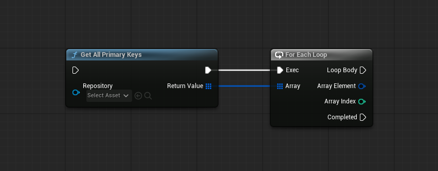
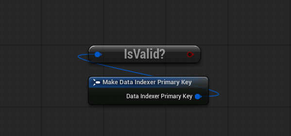
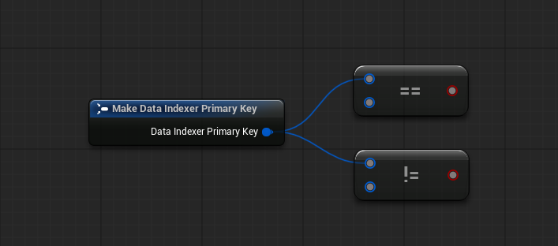
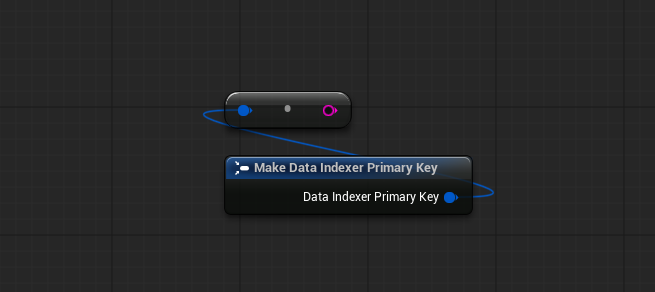
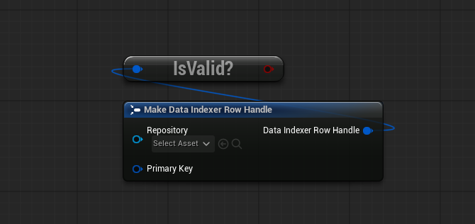
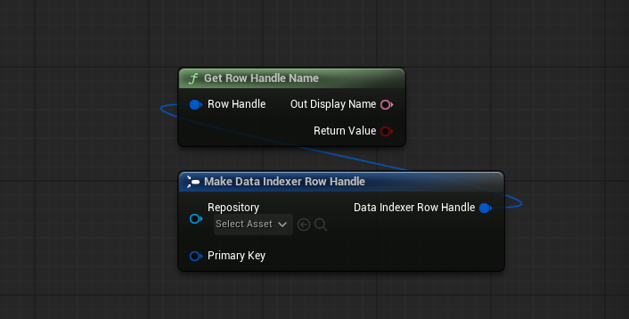

# Function Library

`UDataIndexerFunctionLibrary` は `UBlueprintFunctionLibrary` で、Blueprint グラフで DataIndexer 型を操作するユーティリティノードを提供します。すべてのノードは **DataIndexer** カテゴリに属します。

---

## Get All Primary Keys

```
GetAllPrimaryKeys(Repository) → TArray<FDataIndexerPrimaryKey>
```

{ .fn-node }

Repositoryを通して見えるすべてのPrimaryKeyを返します（親Repositoryを含む）。Blueprint で UI リストへの表示やすべての行の走査に使います。

---

## Primary Key ノード

### Is Valid Primary Key

```
IsValidPrimaryKey(PrimaryKey) → bool
```

{ .fn-node }

PrimaryKeyがゼロでない場合（`FGuid::IsValid()`）に `true` を返します。

---

### Equal / Not Equal

```
EqualEqual_PrimaryKeyPrimaryKey(A, B) → bool
NotEqual_PrimaryKeyPrimaryKey(A, B) → bool
```

{ .fn-node }

コンパクトノードタイトルは `==` と `!=`。`BlueprintThreadSafe`。

2 つの `FDataIndexerPrimaryKey` の等値比較を行います。`FGuid::operator==` に委譲します。

---

### To String

```
Conv_PrimaryKeyToString(PrimaryKey) → FString
```

{ .fn-node }

コンパクトノードタイトルは `→`。`BlueprintAutocast`、`BlueprintThreadSafe`。

PrimaryKeyを GUID 文字列表現（例：`"A1B2C3D4-..."`）に変換します。

---

## Row Handle ノード

### Is Valid Row Handle

```
IsValidRowHandle(RowHandle) → bool
```

{ .fn-node }

`RowHandle.Repository` と `RowHandle.PrimaryKey` の両方が有効な場合に `true` を返します。

---

### Get Row Handle Name

```
GetRowHandleName(RowHandle, OutDisplayName) → bool
```

{ .fn-node }

行のSchema駆動の表示名を取得します。ハンドルが無効またはSchemaが表示名を返さない場合は `false` を返します。

---

### Get Row Handle Value

```
GetRowHandleValue(Handle, OutValue) → bool  [CustomThunk, BlueprintInternalUseOnly]
```

ハンドルから型付き行構造体を `OutValue` に取り出します。`OutValue` ワイルドカードピンには正しい行構造体型の変数を接続する必要があります。ハンドルが無効な場合は `false` を返します。

!!! note
    このノードは `BlueprintInternalUseOnly` としてマークされています。推奨される型付き取得には `UK2Node_DataIndexerGetRow` の **Get Row** K2 ノードを使用してください。

---

## Rows Handle ノード

### Get Rows Handle Value

```
GetRowsHandleValue(Handle, Query, OutKeys) → bool  [CustomThunk, BlueprintInternalUseOnly]
```

ワイルドカードの `Query` 構造体にマッチするPrimaryKeyを `OutKeys` に書き込みます。`Query` ピンにはSchemaに登録された具体的なIndex クエリ構造体型を接続する必要があります。マッチするキーが 1 件以上あれば `true` を返します。

!!! note
    このノードは `BlueprintInternalUseOnly` としてマークされています。`FDataIndexerKeysHandle` を解決するときに K2 ノードが内部で使用します。

---

