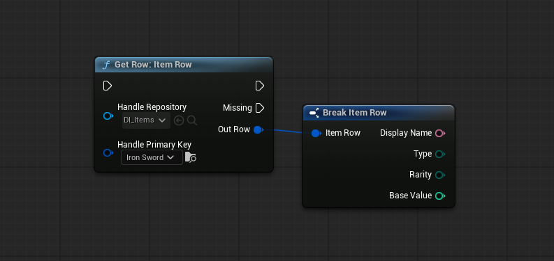
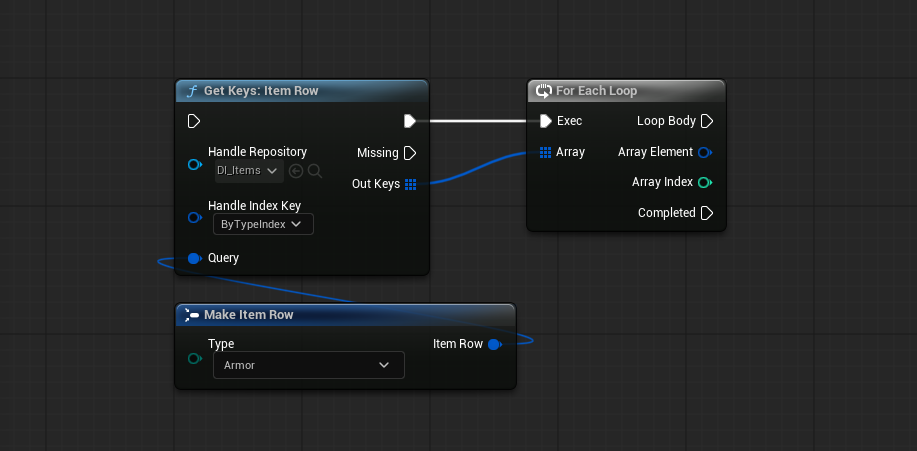
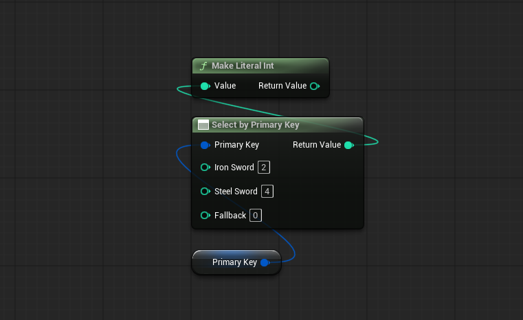
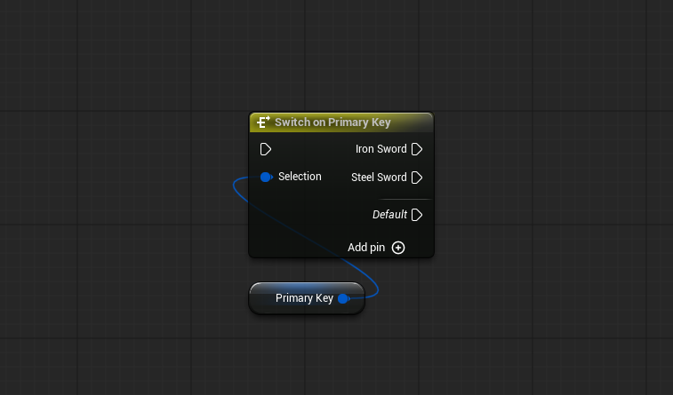

# カスタム K2 ノード

DataIndexer は標準の `UFUNCTION` では表現できない 4 種類のカスタム Blueprint グラフノードを提供します。これらのノードはSchemaとRepositoryの設定に基づいてコンパイル時に型付きピンを生成します。

---

## Get Row（`UK2Node_DataIndexerGetRow`）

Blueprint で型付き行を取得する主要な方法です。

**目的：** `FDataIndexerRowHandle` を受け取り、型安全な方法で行構造体の値を取得します。成功・失敗の実行パスを持ちます。

**ピン構成：**

| ピン | 方向 | 型 | 説明 |
|-----|------|----|------|
| （exec） | 入力 | — | エントリ実行 |
| `Handle` | 入力 | `FDataIndexerRowHandle` | 取得する行。ノード配置時に `Repository` と `PrimaryKey` サブピンへ自動スプリット |
| ✓（Then） | 出力（exec） | — | 行が見つかった |
| ✗（Missing） | 出力（exec） | — | 行が見つからないまたはハンドルが無効 |
| `Out Row` | 出力 | ワイルドカード → `FMyRowStruct` | 型付き行構造体 |

**使い方：**

1. Blueprint グラフに **Get Row** ノードを配置する
2. `Handle` ピンの `Repository` サブピンにアセット参照を設定する
3. `Handle` ピンの `PrimaryKey` サブピンにキーを接続する
4. `Out Row` 出力ピンが Repository の行構造体型に解決される

---

## Get Keys by Index（`UK2Node_DataIndexerGetKeysByIndex`）

インデックスキーに基づいて、一致する行のプライマリキー一覧を取得するノードです。

**目的：** `FDataIndexerKeysHandle` とクエリ構造体を受け取り、条件に一致する `FDataIndexerPrimaryKey` の配列を返します。成功・失敗の実行パスを持ちます。

**ピン構成：**

| ピン | 方向 | 型 | 説明 |
|-----|------|----|------|
| （exec） | 入力 | — | エントリ実行 |
| `Handle` | 入力 | `FDataIndexerKeysHandle` | 検索対象。配置時に `Repository` と `IndexKey` サブピンへ自動スプリット |
| `Query` | 入力 | ワイルドカード → 行構造体 | 絞り込み条件となるクエリ構造体 |
| ✓（Then） | 出力（exec） | — | 1 件以上のキーが見つかった |
| ✗（Missing） | 出力（exec） | — | 該当なし、またはハンドルが無効 |
| `Out Keys` | 出力 | `TArray<FDataIndexerPrimaryKey>` | 一致したプライマリキーの配列 |

---

## Select by Primary Key（`UK2Node_DataIndexerSelectPrimaryKey`）

`FDataIndexerPrimaryKey` の値に基づいて **値** を選択する純粋ノードです。

**目的：** PrimaryKey がどの行を指しているかによって異なる値を返します。DataIndexer 行用の `Select` ノードに相当します。exec ピンはありません（純粋ノード）。

**ノードプロパティ（Details パネルで設定）：**

| プロパティ | 型 | 説明 |
|-----------|-----|------|
| `Repository` | `UDataIndexerRepository*` | 有効な選択肢となるキーを制限する |
| `Pin Keys` | `TArray<FDataIndexerPrimaryKey>` | ケースピンとして展開するキー一覧 |
| `Has Default Pin` | `bool` | `Fallback` 入力ピンを生成するか（デフォルト: true） |

**ピン構成：**

| ピン | 方向 | 型 | 説明 |
|-----|------|----|------|
| `PrimaryKey` | 入力 | `FDataIndexerPrimaryKey` | 選択に使うキー |
| `[Row Name]` | 入力（キーごと） | ワイルドカード → 任意の型 | `Pin Keys` に設定された各キーに対応する値入力ピン |
| `Fallback` | 入力（省略可） | ワイルドカード → 任意の型 | どのキーにもマッチしない場合に返す値（`Has Default Pin = true` のとき） |
| （ReturnValue） | 出力 | ワイルドカード → 任意の型 | 選択された値 |

---

## Switch on Primary Key（`UK2Node_DataIndexerSwitchPrimaryKey`）

`FDataIndexerPrimaryKey` の値に基づいて **実行** をルーティングするスイッチノードです。

**目的：** PrimaryKey がどの行をアドレスしているかによって実行を分岐します。DataIndexer 行用の `Switch on Int` ノードに相当します。

**ノードプロパティ（Details パネルで設定）：**

| プロパティ | 型 | 説明 |
|-----------|-----|------|
| `Repository` | `UDataIndexerRepository*` | 有効な選択肢となるキーを制限する |
| `Pin Keys` | `TArray<FDataIndexerPrimaryKey>` | 出力実行ピンとして展開するキー一覧 |

**ピン構成：**

| ピン | 方向 | 型 | 説明 |
|-----|------|----|------|
| （exec） | 入力 | — | エントリ実行 |
| `Selection` | 入力 | `FDataIndexerPrimaryKey` | スイッチ対象のキー |
| `Default` | 出力（exec） | — | 設定済みピンにどれもマッチしない場合に発火 |
| `[Row Name]` | 出力（exec、キーごと） | — | `Pin Keys` に設定された各キーに 1 つ |

---

!!! tip "どのノードを使うか"
    - **Get Row** — ハンドルを持っていて行データが欲しい場合
    - **Get Keys by Index** — インデックスキーで行を検索してキー一覧が欲しい場合
    - **Select by Primary Key** — キーを持っていて、どの行かによって値を選びたい場合
    - **Switch on Primary Key** — キーを持っていて、どの行かによって実行を分岐したい場合
