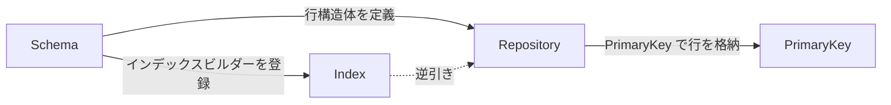

# コアコンセプト

DataIndexer は 4 つの相互に関連するコンセプトで構成されています。これらの関係を理解することで、他のすべてがつながります。

## 4 つのコンセプト

[**Repository**](repository.md)
: 行を保持するデータアセット。プライマリキーからインスタンス化された行構造体への `TMap`、およびセカンダリインデックス用の逆引きテーブルを格納します。親 Repository を参照して行を複製せずに継承できます。

[**Schema**](schema.md)
: Repository とエディタ動作の間のコントラクト。行構造体の型を定義し、表示名ロジックを提供し、Data View に表示するカラムを制御し、インデックスビルダー関数を登録します。

[**Keys & Handles**](keys-and-handles.md)
: 行を特定するアドレス型。`FDataIndexerPrimaryKey` は単一行を安定して識別する GUID。`FDataIndexerRowHandle` は Blueprint 変数や UPROPERTY フィールド用にリポジトリ参照とプライマリキーをペアにします。`FDataIndexerRowsHandle` はリポジトリとインデックス識別子を格納し、マッチする行のセットはクエリ時に部分的に埋めた行構造体を渡して解決します。

[**Indexes**](indexes.md)
: セカンダリ検索軸。インデックス（`FDataIndexerIndex`、GUID で識別）はカテゴリ・陣営・レアリティなどのドメイン属性をプライマリキーのセットにマップします。Schema は各行の GUID キーを計算するビルダー関数を登録します。
