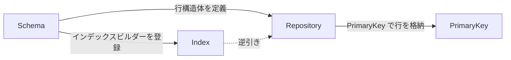

# コアコンセプト

DataIndexer は 4 つの相互に関連するコンセプトで構成されています。これらの関係を理解することで、他のすべてがつながります。

## 4 つのコンセプト

- :material-database:{ .lg .middle } &nbsp; **[Repository](repository.md)**

    ---

    行を保持するデータアセット。プライマリキーからインスタンス化された行構造体への `TMap`、およびセカンダリインデックス用の逆引きテーブルを格納します。

- :material-file-document-outline:{ .lg .middle } &nbsp; **[Schema](schema.md)**

    ---

    Repository とエディタ動作の間のコントラクト。行構造体の型を定義し、表示名ロジックを提供し、Data View に表示するカラムを制御し、インデックスビルダー関数を登録します。

- :material-key-variant:{ .lg .middle } &nbsp; **[Keys & Handles](keys-and-handles.md)**

    ---

    行を特定するアドレス型。`FDataIndexerPrimaryKey` は単一行を識別する GUID。`FDataIndexerRowHandle` はリポジトリ参照とキーをペアにし、`FDataIndexerKeysHandle` はインデックスクエリ用のキーセットを解決します。

- :material-table-search:{ .lg .middle } &nbsp; **[Indexes](indexes.md)**

    ---

    セカンダリ検索軸。`FDataIndexerIndex`（GUID）はカテゴリ・陣営・レアリティなどの属性をプライマリキーのセットにマップします。Schema がビルダー関数を登録します。

