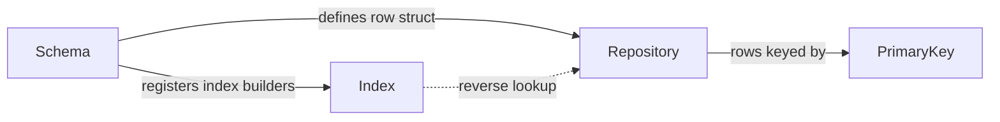

# Core Concepts

DataIndexer is built around four interconnected concepts. Understanding how they relate makes everything else click.

## The four concepts

[**Repository**](repository.md)
: The data asset that holds rows. A repository stores a `TMap` of primary keys to instanced row structs, plus reverse lookup tables for secondary indexes. Repositories can reference parent repositories to inherit rows without duplication.

[**Schema**](schema.md)
: The contract between a repository and its editor behavior. A schema defines the row struct type, provides display name logic, controls which columns appear in the Data View, and registers index builder functions.

[**Keys & Handles**](keys-and-handles.md)
: The address types used to locate rows. `FDataIndexerPrimaryKey` is a GUID that stably identifies a single row. `FDataIndexerRowHandle` pairs a repository reference with a primary key for use in Blueprint variables and UPROPERTY fields. `FDataIndexerRowsHandle` stores a repository and an index identifier; the matching row set is resolved at query time by passing a partially-filled row struct.

[**Indexes**](indexes.md)
: Secondary lookup dimensions. An index (identified by `FDataIndexerIndex`, a GUID) maps a domain attribute — category, faction, rarity — to a set of primary keys. The schema registers the builder function that computes a GUID key for each row.
