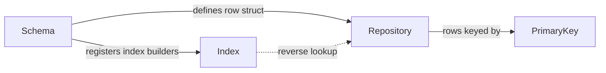

---
hide:
  - navigation
---

# Core Concepts

DataIndexer is built around four interconnected concepts. Understanding how they relate makes everything else click.

## The four concepts

- :material-database:{ .lg .middle } &nbsp; **[Repository](repository.md)**

    ---

    The data asset that holds rows. Stores a `TMap` of primary keys to instanced row structs, plus reverse lookup tables for secondary indexes. Repositories can reference parent repositories to inherit rows without duplication.

- :material-file-document-outline:{ .lg .middle } &nbsp; **[Schema](schema.md)**

    ---

    The contract between a repository and its editor behavior. Defines the row struct type, provides display name logic, controls Data View columns, and registers index builder functions.

- :material-key-variant:{ .lg .middle } &nbsp; **[Keys & Handles](keys-and-handles.md)**

    ---

    Address types for locating rows. `FDataIndexerPrimaryKey` is a stable GUID. `FDataIndexerRowHandle` pairs a repository with a key. `FDataIndexerKeysHandle` resolves a matching key set at query time via an index.

- :material-table-search:{ .lg .middle } &nbsp; **[Indexes](indexes.md)**

    ---

    Secondary lookup dimensions. An index (`FDataIndexerIndex`, a GUID) maps a domain attribute — category, faction, rarity — to a set of primary keys. The schema registers the builder function for each row.

