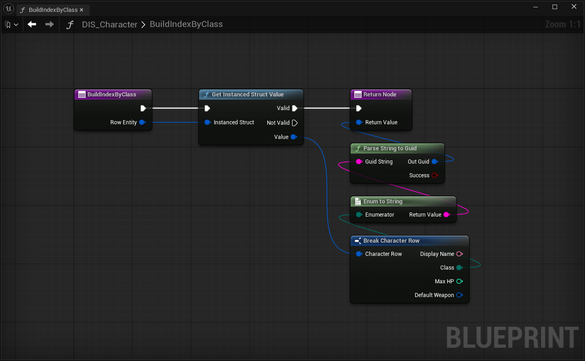

# Index

Indexはセカンダリ検索軸で、カテゴリ・陣営・レアリティなど任意のドメイン属性で行のセットを取得できます。Repository全体を走査せず、直接マルチマップ参照によって O(マッチ数) で結果を返します。

## 型

| 型 | 役割 |
|----|------|
| `FDataIndexerIndex` | 検索軸を識別する。決定論的 GUID とエディタ専用の `DevComment` を保持 |

IndexKeyはビルダー関数が返す生の `FGuid` 値です。`FDataIndexerIndexKey` のような独立した型はありません。

## Indexの仕組み

保存時にコンパイラが各行に対してすべての **BuildIndex** 関数を呼び出します。ビルダーはIndexKeyとなる `FGuid` を返し、任意でエディタ表示用の `FText` を設定します。結果はRepositoryの `ReverseLookups` テーブルに格納されます。

```
ReverseLookups[FDataIndexerIndex] → { TMap<FGuid, TArray<FDataIndexerPrimaryKey>> }
```

実行時の `Repository.ForEachPrimaryKeys(Index, Query, Callback)` はビルダーをクエリ構造体に対して呼び出してルックアップ GUID を導出し、マップを直接引くため高速です。

## Indexの定義

### C++ の場合

Schemaクラスに `DI_DEFINE_INDEX` マクロでIndexを宣言します。マクロはクラスパスと名前から決定論的 GUID を生成する静的アクセサ関数を展開します。

!!! note "プロジェクト側で定義が必要"
    `DI_DEFINE_INDEX` は DataIndexer Pluginには含まれていません。プロジェクトのヘッダ（例：`DataIndexerKeyHelpers.h`）に以下のように定義してください。

```cpp title="DataIndexerKeyHelpers.h"
#define DI_DEFINE_INDEX( VarName ) \
    static const FDataIndexerIndex& VarName() \
    { \
        static const FDataIndexerIndex Key \
        { \
            FGuid::NewDeterministicGuid( StaticClass()->GetPathName() + TEXT( "." #VarName ) ), \
            INVTEXT( #VarName ) \
        }; \
        return Key; \
    }
```

```cpp title="ItemSchema.h"
UCLASS()
class UItemSchema : public UDataIndexerSchema
{
    GENERATED_BODY()
public:
    UItemSchema();

    DI_DEFINE_INDEX(ByTypeIndex);
    DI_DEFINE_INDEX(ByRarityIndex);

protected:
    UFUNCTION()
    static FGuid BuildTypeIndex(const FInstancedStruct& RowEntity);

    UFUNCTION()
    static FGuid BuildRarityIndex(const FInstancedStruct& RowEntity);
};
```

コンストラクタでビルダーを登録します。

```cpp title="ItemSchema.cpp"
UItemSchema::UItemSchema()
{
    RowStruct = FItemRow::StaticStruct();
    RegisterFunction_BuildIndex(ByTypeIndex(),   GET_FUNCTION_NAME_CHECKED(ThisClass, BuildTypeIndex));
    RegisterFunction_BuildIndex(ByRarityIndex(), GET_FUNCTION_NAME_CHECKED(ThisClass, BuildRarityIndex));
}

FGuid UItemSchema::BuildTypeIndex(const FInstancedStruct& RowEntity)
{
    if (const FItemRow* Row = RowEntity.GetPtr<const FItemRow>())
    {
        return FGuid(static_cast<uint32>(Row->Type), 0, 0, 0);
    }
    return {};
}
```

### Blueprint の場合

1. Schema Blueprint を開いて **Class Defaults** へ
2. **Build Index Functions** にエントリを追加：
   - **キー**：`FDataIndexerIndex` 変数（固定 GUID を変数デフォルト値に設定）
   - **Value**：`Prototype_BuildIndex` シグネチャに合った関数参照（`RowEntity → FGuid`）

実装例（クラス別Index）：



`Get Instanced Struct Value` で行データを取り出し、`Enum to String` → `Parse String to Guid` でクラス Enum から決定論的 GUID を生成して返します。

## Indexによるクエリ

**C++** — クエリとして使いたいフィールドだけを埋めた行を渡します。

```cpp
// Weapon タイプのアイテムをすべて取得
FItemRow Query;
Query.Type = EItemType::Weapon;

TArray<FDataIndexerPrimaryKey> Keys =
    FItemInterface::GetPrimaryKeys(*Repository, UItemSchema::ByTypeIndex(), Query);
```

逆引きIndex（例：特定のアイテムを `DefaultWeapon` に持つキャラクターを取得）:

```cpp
FCharacterRow Query;
Query.DefaultWeapon.PrimaryKey = WeaponKey;

TArray<FDataIndexerPrimaryKey> Characters =
    FCharacterInterface::GetPrimaryKeys(*Repository,
        UCharacterSchema::ByDefaultWeaponIndex(), Query);
```

**Blueprint:**

`FDataIndexerKeysHandle` UPROPERTY と **Get Rows Handle キー** 関数ライブラリノードを使います。ノードはハンドルと **クエリ** ワイルドカード構造体ピンを受け取ります。Indexを駆動するフィールドを埋めてください（例：`ByType` Indexなら `Type = Weapon` を設定）。

## IndexKeyの安定性

ビルダー関数が返す GUID はエディタをまたいで不変でなければなりません。enum の序数・文字列ハッシュなど安定した値から導出してください。ビルダー内で `FGuid::NewGuid()` を使うのは NG です。

`DI_DEFINE_INDEX` は `FGuid::NewDeterministicGuid(StaticClass()->GetPathName() + "." + Index名)` を使用するため、Index名やSchemaクラス名（`GetPathName()` が変わる）のリネームは GUID 変更を引き起こします。これらの名前は安定した API として扱ってください。

!!! note "ReverseLookups の再構築タイミング"
    エディタでは参照時に自動構築されます。パッケージビルドではクック時に構築されるため、手動での再保存は不要です。
