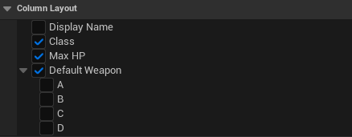

# Schema

`UDataIndexerSchema` は Repository とエディタ動作の間のコントラクトです。抽象 `UObject` サブクラスであり、直接インスタンス化せず、特定のデータ型を定義するために Blueprint または C++ でサブクラス化します。

## 役割

Schema は 3 つのことを担当します。

1. **行構造体の宣言** — `RowStruct` は Repository の `LocalEntries` に格納される構造体型を識別する `TObjectPtr<const UScriptStruct>` です。
2. **表示ロジックの提供** — `GetRowDisplayName` はバインドされた **Row Display Name Function**（または C++ オーバーライド）を解決し、任意の行に対して人間可読なラベルを返します。エディタ UI 全体で使用されます。
3. **拡張関数の登録** — Index キー生成・プロパティのセルウィジェットをカスタマイズする関数を、実際の row struct を直接受け取る Blueprint または C++ の名前付き関数としてバインドします。

## サブクラス化

=== "C++"

    ### 宣言と初期化

    `RowStruct` はコンストラクタで設定します。

    ```cpp
    UCLASS()
    class UItemSchema : public UDataIndexerSchema
    {
        GENERATED_BODY()

    public:
        UItemSchema();

        DI_DEFINE_INDEX(ByTypeIndex);
        DI_DEFINE_INDEX(ByRarityIndex);

    protected:
        virtual TOptional<FText> GetRowDisplayName(
            const FDataIndexerPrimaryKey& PrimaryKey,
            const FConstStructView& RowEntity) const override;

        UFUNCTION()
        static FGuid BuildTypeIndex(const FItemRow& Row);

        UFUNCTION()
        static FGuid BuildRarityIndex(const FItemRow& Row);
    };
    ```

    ```cpp
    UItemSchema::UItemSchema()
    {
        RowStruct = FItemRow::StaticStruct();

        RegisterFunction_BuildIndex( ByTypeIndex(),    GET_FUNCTION_NAME_CHECKED( ThisClass, BuildTypeIndex ) );
        RegisterFunction_BuildIndex( ByRarityIndex(),  GET_FUNCTION_NAME_CHECKED( ThisClass, BuildRarityIndex ) );
    }
    ```

    `DI_DEFINE_INDEX` で宣言したIndexごとに `RegisterFunction_BuildIndex` を呼び出し、ビルダー関数を紐付けます。

    ### GetRowDisplayName

    `GetRowDisplayName` の `virtual` をオーバーライドして行の表示名を返します。`RowEntity` は `FConstStructView` なので、1 行で実際の row struct にアンパックしてフィールドを返します。

    ```cpp
    TOptional<FText> UItemSchema::GetRowDisplayName(
        const FDataIndexerPrimaryKey& PrimaryKey,
        const FConstStructView& RowEntity) const
    {
        return RowEntity.Get<const FItemRow>().DisplayName;
    }
    ```

    ### Build Index Functions

    `DI_DEFINE_INDEX` でIndexを宣言し、対応する `static UFUNCTION` をビルダーとして実装します。ビルダーは**実際の row struct** を直接受け取ります（[Index](indexes.md) 参照）。

    ```cpp
    FGuid UItemSchema::BuildTypeIndex(const FItemRow& Row)
    {
        return FGuid( static_cast<uint32>( Row.Type ), 0, 0, 0 );
    }
    ```

=== "Blueprint"

    ### Row Struct の設定

    1. 親クラスに `DataIndexerSchema` を指定して **Blueprint Class** を作成する
    2. **Class Defaults** で **Row Struct** を使用する `USTRUCT` に設定する

    ### GetRowDisplayName

    **Class Defaults** で **Row Display Name Function** を、行構造体のフィールドから意味のある `FText` を返す関数にバインドします。関数は**実際の row struct** を直接受け取るため `Get Instanced Struct Value` ノードは不要です。このラベルはエディタ UI 全体の行一覧・ピッカーで使用されます。

    ### Build Index Functions

    **Class Defaults** の **Build Index Functions** マップでIndex ビルダーを登録します。キーはIndex、値は**実際の row struct** を受け取り `FGuid` を返す関数です。ピッカーは一致する関数のみ絞り込み、「Create matching function」は実際の row 引数のスタブを生成します（[Index](indexes.md) 参照）。

    ### Property Cell Widget Customizations

    **Class Defaults** の **Property Widget Customizations** マップで、プロパティ名をキーに `UUserWidget*` を返す関数を登録します。Data View グリッドのセル表示をカスタマイズできます。

    カスタマイズ関数が `nullptr` を返した場合は、デフォルトのセル表示にフォールバックします。

## データバリデーション

!!! warning "Blueprint 未対応"
    `IsRowValid` の Blueprint オーバーライドは現在対応していません。バリデーションは C++ でのみ実装できます。

`IsRowValid` をオーバーライド（エディタ専用）して、各行のバリデーションロジックを追加します。

検証は次のタイミングで自動的に実行されます。

- Content Browser で **右クリック → Validate Data** を選択したとき
- アセット保存時（エディタ設定で **Save Validation** を有効にした場合）
- クック時

戻り値が `EDataValidationResult::Invalid` の場合、`Context` に追加したエラーメッセージがエディタに表示され、保存・クックがブロックされます。

```cpp
#if WITH_EDITOR
EDataValidationResult UItemSchema::IsRowValid(
    FConstStructView RowEntity, FDataValidationContext& Context) const
{
    if (const FItemRow* Row = RowEntity.GetPtr<const FItemRow>())
    {
        if (Row->BaseValue < 0)
        {
            Context.AddError(NSLOCTEXT("Item", "BadValue", "BaseValue must be >= 0"));
            return EDataValidationResult::Invalid;
        }
    }
    return EDataValidationResult::Valid;
}
#endif
```

## カラムレイアウト（ExpandedStructEntries）

`ExpandedStructEntries` は Data View グリッドでネスト構造体のどのプロパティを個別カラムとして表示するかを制御します。デフォルトでは `RowStruct` のすべてのトップレベルプロパティがカラムとして表示されます。

C++ で `InitializeExpandedStructEntries` をオーバーライドしてプログラムから設定できます。

```cpp
void UItemSchema::InitializeExpandedStructEntries()
{
    Super::InitializeExpandedStructEntries();

    // SomeField をトップレベルから除外（インライン表示に戻す）
    if (FDataIndexerExpandedStructEntry* Entry = ExpandedStructEntries.Find(RowStruct))
    {
        *Entry -= GET_MEMBER_NAME_CHECKED(FItemRow, SomeField);
    }

    // ネスト構造体のプロパティをカラムに展開
    ExpandedStructEntries.FindOrAdd(FMyInnerStruct::StaticStruct()) += {
        GET_MEMBER_NAME_CHECKED(FMyInnerStruct, A),
        GET_MEMBER_NAME_CHECKED(FMyInnerStruct, B),
    };
}
```

Blueprint では Class Defaults パネルの **Expanded Struct Entries** マップから切り替えられます。


