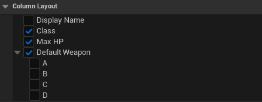

# Schema

`UDataIndexerSchema` is the contract between a repository and its editor behavior. It is an abstract `UObject` subclass — you never instantiate it directly, but always subclass it (in Blueprint or C++) to define a specific data type.

## Role

A schema does three things:

1. **Declares the row struct** — `RowStruct` is a `TObjectPtr<const UScriptStruct>` that identifies the struct type stored in the repository's `LocalEntries`.
2. **Provides display logic** — `GetRowDisplayName` is a `BlueprintNativeEvent` that returns a human-readable label for any row, used throughout the editor UI.
3. **Registers extension functions** — functions that generate index keys, customize property display text, and replace editor widgets are registered as named Blueprint or C++ functions.

## Subclassing

=== "C++"

    ### Declaration and initialization

    Set `RowStruct` in the constructor.

    ```cpp
    UCLASS()
    class UItemSchema : public UDataIndexerSchema
    {
        GENERATED_BODY()

    public:
        UItemSchema();

        DI_DEFINE_INDEX(ByTypeIndex);
        DI_DEFINE_INDEX(ByRarityIndex);

    protected:
        virtual FText GetRowDisplayName_Implementation(
            const FDataIndexerPrimaryKey& PrimaryKey,
            const FInstancedStruct& RowEntity) const override;

        UFUNCTION()
        static FGuid BuildTypeIndex(const FInstancedStruct& RowEntity);

        UFUNCTION()
        static FGuid BuildRarityIndex(const FInstancedStruct& RowEntity);
    };
    ```

    ```cpp
    UItemSchema::UItemSchema()
    {
        RowStruct = FItemRow::StaticStruct();

        RegisterFunction_BuildIndex( ByTypeIndex(),    GET_FUNCTION_NAME_CHECKED( ThisClass, BuildTypeIndex ) );
        RegisterFunction_BuildIndex( ByRarityIndex(),  GET_FUNCTION_NAME_CHECKED( ThisClass, BuildRarityIndex ) );
    }
    ```

    Call `RegisterFunction_BuildIndex` once per `DI_DEFINE_INDEX` declaration to bind each builder function.

    ### GetRowDisplayName_Implementation

    Override `GetRowDisplayName_Implementation` to return the display name for a row. Fall back to `Super` when the row is not recognized.

    ```cpp
    FText UItemSchema::GetRowDisplayName_Implementation(
        const FDataIndexerPrimaryKey& PrimaryKey,
        const FInstancedStruct& RowEntity) const
    {
        if (const FItemRow* Row = RowEntity.GetPtr<const FItemRow>())
        {
            return Row->DisplayName;
        }
        return Super::GetRowDisplayName_Implementation( PrimaryKey, RowEntity );
    }
    ```

    ### Build Index Functions

    Declare indexes with `DI_DEFINE_INDEX` and implement the corresponding `static UFUNCTION` as the builder (see [Indexes](indexes.md)).

    ```cpp
    FGuid UItemSchema::BuildTypeIndex(const FInstancedStruct& RowEntity)
    {
        if (const FItemRow* Row = RowEntity.GetPtr<const FItemRow>())
        {
            return FGuid( static_cast<uint32>( Row->Type ), 0, 0, 0 );
        }
        return {};
    }
    ```

    ### Property Text Customizations

    Register property name and function pointer pairs in the `PropertyTextCustomizations` map. Equivalent to the Blueprint **Property Text Customizations** map.

    Declare one `static UFUNCTION` per property and call `RegisterFunction_PropertyTextCustomization` in the constructor.

    ```cpp
    // In the class declaration
    UFUNCTION()
    static FText GetTypeDisplayText(const FInstancedStruct& RowEntity);
    ```

    ```cpp
    UItemSchema::UItemSchema()
    {
        RowStruct = FItemRow::StaticStruct();

        RegisterFunction_PropertyTextCustomization(
            GET_MEMBER_NAME_CHECKED(FItemRow, Type),
            GET_FUNCTION_NAME_CHECKED(ThisClass, GetTypeDisplayText));
    }
    ```

    ```cpp
    FText UItemSchema::GetTypeDisplayText(const FInstancedStruct& RowEntity)
    {
        if (const FItemRow* Row = RowEntity.GetPtr<const FItemRow>())
        {
            switch (Row->Type)
            {
                case EItemType::Weapon: return NSLOCTEXT("Item", "TypeWeapon", "Weapon");
                case EItemType::Armor:  return NSLOCTEXT("Item", "TypeArmor",  "Armor");
                default: break;
            }
        }
        return FText::GetEmpty();
    }
    ```

=== "Blueprint"

    ### Row Struct

    1. Create a **Blueprint Class** with parent `DataIndexerSchema`
    2. In **Class Defaults**, assign **Row Struct** to your `USTRUCT`

    ### GetRowDisplayName

    Override `GetRowDisplayName` in **Class Defaults** and return a meaningful `FText` from the row struct fields. This label is used throughout the editor UI in row lists and pickers.

    ### Build Index Functions

    Use the **Build Index Functions** map in **Class Defaults** to register index builders. The key is the index name (string), the value is a function returning `FGuid` (see [Indexes](indexes.md)).

    ### Property Text Customizations

    Use the **Property Text Customizations** map in **Class Defaults** to register per-property text rendering. The key is the property name, the value is a function returning `FText`. Overrides how property values appear in the Data View grid.

    Add an entry for each property you want to override. For example, to render `Type` as a localized label instead of the raw enum integer:

    | Key (property name) | Value (function) |
    |---|---|
    | `Type` | `GetTypeDisplayText` |

    The function must accept `FInstancedStruct` (the row) and return `FText`. Return `FText::GetEmpty()` to fall back to the default display.

## Data validation

!!! warning "Blueprint not supported"
    Blueprint override of `IsRowValid` is not currently supported. Validation must be implemented in C++.

Override `IsRowValid` (editor-only) to add per-row validation logic.

Validation runs automatically at the following points:

- When selecting **Validate Data** via right-click in the Content Browser
- On asset save (if **Save Validation** is enabled in editor settings)
- During cook

A return value of `EDataValidationResult::Invalid` surfaces the errors added to `Context` in the editor and blocks save and cook.

```cpp
#if WITH_EDITOR
EDataValidationResult UItemSchema::IsRowValid(
    FConstStructView RowEntity, FDataValidationContext& Context) const
{
    if (const FItemRow* Row = RowEntity.GetPtr<const FItemRow>())
    {
        if (Row->MaxStack <= 0)
        {
            Context.AddError(NSLOCTEXT("MyItem", "BadStack", "MaxStack must be > 0"));
            return EDataValidationResult::Invalid;
        }
    }
    return EDataValidationResult::Valid;
}
#endif
```

## Column layout (ExpandedStructEntries)

`ExpandedStructEntries` controls which nested struct properties appear as individual columns in the Data View grid. By default all top-level properties of `RowStruct` are shown as columns.

Override `InitializeExpandedStructEntries` in C++ to configure this programmatically:

```cpp
void UItemSchema::InitializeExpandedStructEntries()
{
    Super::InitializeExpandedStructEntries();

    // Collapse SomeField from the top-level struct (keep it inline)
    if (FDataIndexerExpandedStructEntry* Entry = ExpandedStructEntries.Find(RowStruct))
    {
        *Entry -= GET_MEMBER_NAME_CHECKED(FItemRow, SomeField);
    }

    // Expand a nested struct's properties into columns
    ExpandedStructEntries.FindOrAdd(FMyInnerStruct::StaticStruct()) += {
        GET_MEMBER_NAME_CHECKED(FMyInnerStruct, A),
        GET_MEMBER_NAME_CHECKED(FMyInnerStruct, B),
    };
}
```

In Blueprint, toggle the **Expanded Struct Entries** map from the Class Defaults panel.


