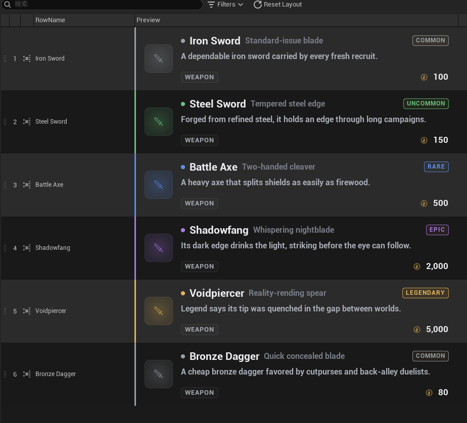

# Custom Cell Widgets

Data View は行の各プロパティをセルとして描画します。Schema はデフォルトのセルウィジェットを差し替えて、
カスタム表示やインライン編集を提供できます。さらに **仮想列 (virtual column)** — 既存プロパティを別名で
エイリアスする追加列 — を宣言でき、*同じ*値を異なる見せ方で複数回出せます。


最初の例では行 struct `FCharacterRow` を使います（ここで扱うフィールドのみ示します）。

```cpp title="CharacterTypes.h"
USTRUCT(BlueprintType)
struct FCharacterRow
{
    FText DisplayName;             // 行名
    TSubclassOf<APawn> PawnClass;  // 後述の 2 つの仮想列がエイリアスするフィールド
};
```

`FCharacterRow` はこの両方を同時に示します。単一の `PawnClass` フィールド（`TSubclassOf<APawn>`）を持ち、
`UCharacterSchema` がそれを **2 つの仮想列** として出します。どちらも **編集可能**ですが、書き戻しの経路が
異なります。

| 列 | 編集 UI | 宣言場所 |
| --- | --- | --- |
| `PawnClassInline` | C++ のインライン編集（エディタ標準の class picker） | `UCharacterSchema`（C++） |
| `PawnClassWidget` | Blueprint で作った `USinglePropertyView` 入りの UserWidget | `DIS_Character` Blueprint + `WBP_PawnClassCell` |

どちらの列も **同じ** `PawnClass` を指すので、片方を編集するともう片方の表示も更新されます。編集は保存され、
Undo もできます。

---

## 仮想列

Data View は通常、行の各プロパティを 1 列ずつ表示します。Schema はこれに加えて、好きな名前の **仮想列**
を追加できます。各列は `FDataIndexerVirtualColumn` で定義します。

```cpp
USTRUCT()
struct FDataIndexerVirtualColumn
{
    FName ColumnName;            // 一意・安定な列 ID（layout/visibility キー、ルーティングキー）
    FText DisplayName;           // ヘッダラベル。空なら ColumnName にフォールバック
    FName SourceProperty;        // 任意。エイリアスする RowStruct メンバ。ネストは "Inner.A"。空 = unbound
    TOptional<float> PreferredWidth; // 任意。初期列幅（px）。未設定 = auto（フォント実測）
};
```

Schema の `VirtualColumns` 配列に追加します。仮想列は通常の列の **後** に並びます。`SourceProperty` の有無で
2 種類に分かれます。

- **エイリアス列**（`SourceProperty` あり）— 既存のプロパティを別名で出すだけの列です。編集・コピー＆ペースト・
  フィルなどは元のプロパティと同じように動き、変わるのは列名と表示名だけ。ネストしたプロパティはドット区切り
  （`"Inner.A"`）で指定します。
- **unbound 列**（`SourceProperty` 空）— 元になるプロパティを持たない列です。セルの中身は Schema が丸ごと
  用意します（読み取り専用の表示や計算結果、カスタム widget など）。元プロパティが無いため、コピー＆ペーストや
  フィルは使えません。

`PreferredWidth`（任意・両フレーバー共通）は列の初期幅を px で指定します。未設定なら内容から自動算出。
あくまで初期値で、ユーザーがリサイズすればそちらが優先されます。

### 仮想列を宣言する

=== "C++"

    Schema のコンストラクタで `VirtualColumns` に追加します。エディタ専用データなので
    `WITH_EDITORONLY_DATA` で囲みます。

    ```cpp title="CharacterSchema.cpp"
    namespace
    {
    const FName PawnClassInlineColumn(TEXT("PawnClassInline"));
    }

    UCharacterSchema::UCharacterSchema()
    {
        // ...
    #if WITH_EDITORONLY_DATA
        FDataIndexerVirtualColumn& InlineColumn = VirtualColumns.AddDefaulted_GetRef();
        InlineColumn.ColumnName = PawnClassInlineColumn;
        InlineColumn.DisplayName = NSLOCTEXT("CharacterSchema", "PawnClassInlineColumn", "Pawn (C++)");
        InlineColumn.SourceProperty = GET_MEMBER_NAME_CHECKED(FCharacterRow, PawnClass);
    #endif
    }
    ```

=== "Blueprint"

    Schema Blueprint（`DIS_Character`）の Class Defaults → **Virtual Columns** でエントリを追加します。

    - `ColumnName` = `PawnClassWidget`
    - `DisplayName` = `Pawn (BP)`
    - `SourceProperty` = `PawnClass`
    - `PreferredWidth` = auto 幅なら未設定のまま、px 値を入れると初期幅を指定

    

!!! note "元の列を隠す"
    あるプロパティを仮想列*だけ*で見せたい場合は、`InitializeExpandedStructEntries` で表示対象から外します
    （`DisplayName` を隠すのと同じやり方です）。

    ```cpp
    if (FDataIndexerExpandedStructEntry* RowStructEntry = ExpandedStructEntries.Find(RowStruct))
    {
        *RowStructEntry -= {
            GET_MEMBER_NAME_CHECKED(FCharacterRow, DisplayName),
            GET_MEMBER_NAME_CHECKED(FCharacterRow, PawnClass),
        };
    }
    ```

    隠したプロパティは Data View の **Column Layout** リストでチェックが外れた状態になり（ここでは
    `Pawn Class` と `Display Name` がオフ）、2 つの仮想列だけが残ります。

    

---

## セルの入口

```cpp
virtual TSharedRef<SWidget> CustomizePropertyCellWidget(
    DataIndexer::IPropertyWidgetContext& Context) const;
```

何も指定しなければ、その列に Blueprint のバインドがあればそれを使い、無ければ単純なテキストになります。
override する場合は `Context` から次の部品を使ってセルを組み立てます。

- `CreateAsSimpleText(Text)` — 読み取り専用のテキストラベルです。渡す `Text` は自由に組み立てられるので、
  ここでセルの表示文字列を好きに書き換えられます（値の整形、別フィールドからの合成、表示用ラベルへの
  置き換えなど）。
- `CreateAsEditInline(Property, bDisplayDefaultPropertyButtons = true)` — 編集できるインラインエディタです。
  Details パネルと同じ **エディタ標準のプロパティ UI**（class picker・数値入力・struct 用のカスタム UI など）を
  そのままセルに表示し、編集は行へ保存されます。

---

## 編集可能なセルを実装する

同じ `PawnClass` を、C++ では `CustomizePropertyCellWidget` の override、Blueprint では
`PropertyWidgetCustomizations` にバインドした UserWidget で編集可能にします。

=== "C++"

    `PawnClassInline` 列に対して `CreateAsEditInline` を返すだけです。エイリアス先の `PawnClass` に対する
    本物のエディタが作られ、編集はそのまま保存されます。

    ```cpp title="CharacterSchema.cpp"
    TSharedRef<SWidget> UCharacterSchema::CustomizePropertyCellWidget(
        DataIndexer::IPropertyWidgetContext& Context) const
    {
        if (Context.GetColumnName() == PawnClassInlineColumn)
        {
            // GetProperty() はエイリアス先の PawnClass に解決されるので、エディタはそこへ書き戻す。
            return Context.CreateAsEditInline(Context.GetProperty(), /*bDisplayDefaultPropertyButtons=*/true);
        }

        return Super::CustomizePropertyCellWidget(Context);
    }
    ```

    `PawnClass` は `TSubclassOf<APawn>` なので、セルにはインラインの class picker が表示されます。
    `CreateAsEditInline` は単一プロパティと、カスタム UI を持つ struct に対応します。コンテナ
    （`TArray`/`TMap`/`TSet`）は対象外です。

    `bDisplayDefaultPropertyButtons`（デフォルト `true`）は標準のプロパティボタン（reset-to-default /
    browse / use-selected）を値エディタの横に付け、Details パネルの 1 行と同じ操作感にします。`false` を
    渡すと値エディタ単体になります。

    !!! note
        `UCharacterSchema` の C++ 実装は、通常の仮想ディスパッチにより Blueprint サブクラス
        `DIS_Character` にも適用されます。この経路で Blueprint を触る必要はありません。

=== "Blueprint"

    この経路は C++ を一切書きません。`PawnClassWidget` 列は `DIS_Character` の Class Defaults で宣言し
    （上記「仮想列を宣言する」参照）、Blueprint 関数がセル用の `UserWidget` を返して、Schema の
    `PropertyWidgetCustomizations` でバインドします。ウィジェットは `USinglePropertyView` を持ち、`UpdateRow`
    で編集を行へ書き戻します。

    !!! info "なぜ Editor Utility Widget か"
        `USinglePropertyView` の `Set Object` / `Set Property Name` は **Editor Utility Widget** からしか呼べません。
        そのため `WBP_PawnClassCell` の親クラスは `UserWidget` ではなく `EditorUtilityWidget` にします。

    **セルが書き戻し先を受け取る仕組み**

    セルを作る Blueprint 関数には `(PrimaryKey, Row)` しか渡らず、`UpdateRow` に必要な所属 repository は来ません。
    そこで Data View がウィジェット生成後に、Blueprint interface `IDataIndexerInterface_CellContext` を通して
    repository と PrimaryKey を渡してくれます。セルウィジェットでこの interface を実装すれば、追加の配線なしで
    書き戻しに必要な情報を受け取れます。

    **Step 1 — Editor Utility Widget（`WBP_PawnClassCell`）**

    1. `/Game/GameData/CustomWidget/WBP_PawnClassCell` に Editor Utility Widget Blueprint を作成します
       （親 `EditorUtilityWidget`）。
    2. **Single Property View** を root に配置します。
    3. 変数を 2 つだけ追加します。
        - `Row : FCharacterRow` — 書き戻し用の行データです。バインド関数から渡すので Instance Editable +
          **Expose on Spawn**。
        - `PawnClass : TSubclassOf<APawn>` — Single Property View が表示・編集するスクラッチ値です。`Row` から
          取り出して埋めるので **Transient** にし、Instance Editable / Expose on Spawn は不要です。

        `Repository` と `PrimaryKey` の変数は作りません。後述のとおり `SetCellContext` の入力ピンから直接使います。
    4. **Class Settings → Interfaces** で `IDataIndexerInterface_CellContext` を実装します。

    

    **Step 2 — `SetCellContext` で初期化**

    `SetCellContext` はバインド関数が `Row` を設定した**後**に発火し、引数で `Repository` と `PrimaryKey` を
    受け取ります。view を実値へ向けるのはここが適切です（`Pre Construct` だと spawn 時の値設定と競合し得ます）。

    - `Row` を Break して `PawnClass` 変数にセットします（編集用のスクラッチ値を行から取り出す）。
    - `Single Property View → Set Object (Self)` → `Set Property Name ("PawnClass")` を実行します。
    - `Bind Event to On Property Changed` → カスタムハンドライベントにバインドします。

    引数の `Repository` / `PrimaryKey` は変数に保存せず、Step 3 の `Update Row` ピンへそのまま配線します。

    [](../assets/images/wbp-pawnclasscell-setcellcontext.png){target=_blank}

    **Step 3 — 編集時に書き戻す**

    `On Property Changed` ハンドラ内で次を行います。

    1. `Set members in CharacterRow` で `Row` の `PawnClass` を編集後の値に差し替えます。
    2. `Update Row (Repository, PrimaryKey, Row)` を呼びます（`Repository` / `PrimaryKey` は `SetCellContext`
       のピンから配線）。編集はトランザクションとして保存されるので、C++ のインライン編集と同様に Undo できます。

    **Step 4 — `DIS_Character` のバインド関数**

    セル用の関数（戻り値 `UUserWidget*`、入力に `Row` を取る）を追加します。

    1. クラス `WBP_PawnClassCell` を `Create Widget` し、行全体を `Row` ピン（Expose on Spawn）に渡します。
       `PawnClass` はウィジェット側が `Row` から取り出すので、ここで渡す必要はありません。
    2. ウィジェットを返します。

    

    **Step 5 — 列にバインド**

    `DIS_Character` の Class Defaults → **Property Widget Customizations** でエントリを追加します。キーは
    `PawnClassWidget`（仮想列の `ColumnName`）、関数は `GetPawnClassWidget` です。これで `PawnClassWidget` の
    セルは編集可能な `SinglePropertyView` を描画し、編集は `UpdateRow` で永続化されます。

    

!!! note "2 つのセルの見た目が違う理由"
    

    `PawnClassInline` は class picker の値ウィジェット（と標準プロパティボタン）だけを表示します。
    `PawnClassWidget` は左側にプロパティ名ラベルが出ます。これは `USinglePropertyView` が値ウィジェット
    単体ではなく、名前**と**値からなる完成した単一プロパティ行を描画するためです。

---

## ライブ MVVM ウィジェットを描画する（読み取り専用プレビュー）

読み取り専用の **unbound** 仮想列に実ゲームの UMG ウィジェットをホストすれば、Data View に各行を
インゲームと同じ見た目で表示できます。`UItemSchema` は `InventoryCard` 列でこれを行います。`WBP_InventoryRowCard`
はインゲーム用のアイテム行 UI で、`VM_InventoryRowCard` ビューモデル（行の `FItemRow` を `Row` プロパティ
として公開します）で駆動する **MVVM** ウィジェットです。これを行ごとに描画します。



この例では行 struct `FItemRow` を使います（カードが表示するフィールドのみ示します）。

```cpp title="ItemTypes.h"
USTRUCT(BlueprintType)
struct FItemRow
{
    FText DisplayName;
    FText Subtitle;
    FText Description;
    int32 BaseValue = 0;
    FDataIndexerPrimaryKey Type;    // meta=(Repository="ItemTypeRepository")
    FDataIndexerPrimaryKey Rarity;  // meta=(Repository="ItemRarityRepository")
};
```

`Type` / `Rarity` は別 Repository への型付き参照です。カードは生のキーを表示せず、後述の Schema ヘルパで
表示テキストに解決します。

セルはウィジェットを通常どおり初期化するので、MVVM はエディタ上でも動作*できます*（PIE は不要）。
満たすべきは 2 点です。

1. **WBP → Class Settings → `Can Call Initialized Without Player Context` = true。**
   Data View のセルウィジェットはプレイヤー（`PlayerContext`）を持ちません。このフラグが無いと MVVM の初期化が
   スキップされ、バインドが一切動きません。インゲームと違ってプレイヤー無しで動かすため、このフラグが必須です。

2. **行ごとに別々のビューモデルが必要です。** `VM_InventoryRowCard` はそのままだと全セル — および WBP の
   エディタプレビュー — が 1 つのインスタンスを共有してしまいます。`UItemSchema::CustomizePropertyCellWidget`
   は、セルを作る前に古いビューモデルを捨てておくことで、行ごとに新しいビューモデルが作られるようにします。

    ```cpp title="ItemSchema.cpp"
    if (Context.GetColumnName() == InventoryCardColumn)
    {
        // この行用に新しい VM が生成されるよう、古い行 VM を捨てる。
        ClearInventoryCardVMsFromCollection(GetWorld());
    }
    return Super::CustomizePropertyCellWidget(Context);
    ```

!!! note "行ごとに描画される範囲"
    カードはビューモデルの `Row` から名前・値・subtitle・description を直接表示します。`Type` / `Rarity` の列は
    別 Repository への参照なので、Schema のヘルパ（`GetTypeDisplayName` / `GetRarityDisplayName`）で表示テキストに
    変換し、type チップと rarity バッジに行ごとの実際の値を出します。
