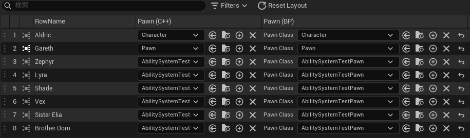
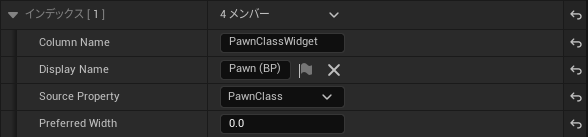
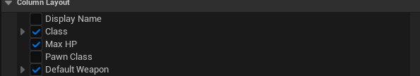
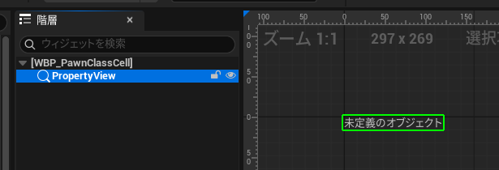
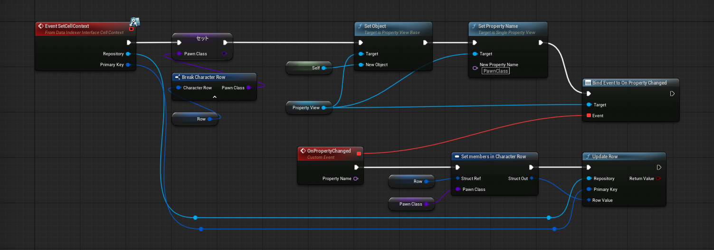
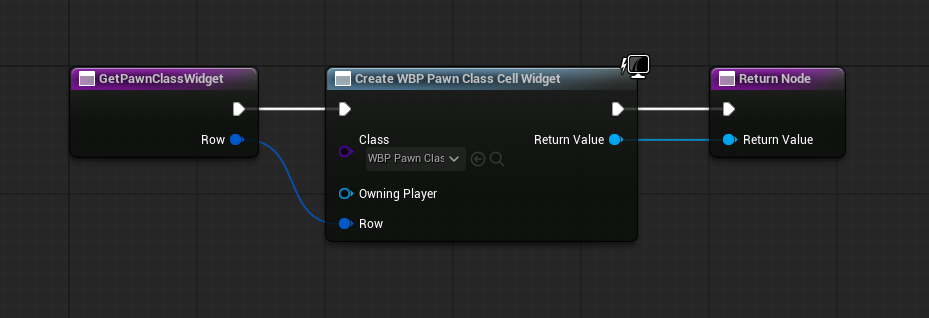
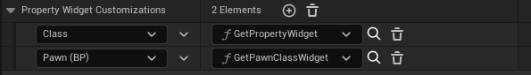
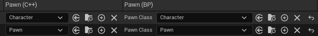
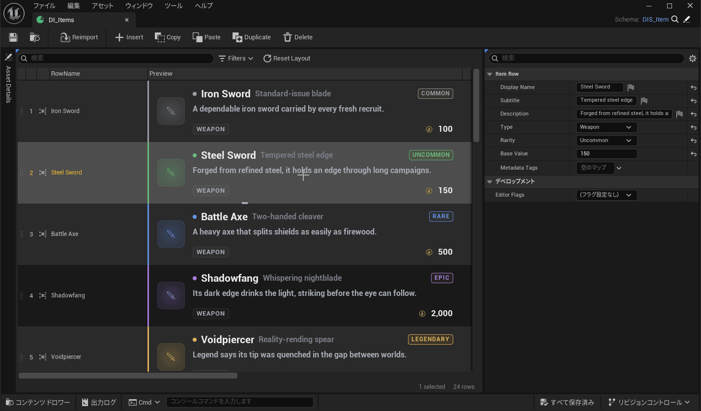

# Custom Cell Widgets

The Data View renders each row property as a cell. A schema can replace the default cell widget to
show a custom display or an inline editor. It can also declare **virtual columns** — extra columns that
alias an existing property under a distinct name — so the *same* value can appear several times with
different presentations.



The first example uses the row struct `FCharacterRow` (only the fields it touches are shown):

```cpp title="CharacterTypes.h"
USTRUCT(BlueprintType)
struct FCharacterRow
{
    FText DisplayName;             // row name
    TSubclassOf<APawn> PawnClass;  // the field the two virtual columns below alias
};
```

`FCharacterRow` demonstrates both ideas at once. It has a single `PawnClass` field
(`TSubclassOf<APawn>`), and `UCharacterSchema` surfaces it as **two editable virtual columns**, each built
a different way:

| Column | Editing UI | Where it's declared |
| --- | --- | --- |
| `PawnClassInline` | C++ inline editing (the standard editor class picker) | `UCharacterSchema` (C++) |
| `PawnClassWidget` | A Blueprint UserWidget hosting a `USinglePropertyView` | `DIS_Character` Blueprint + `WBP_PawnClassCell` |

Both columns point at the **same** `PawnClass`, so editing either one updates what the other shows. Edits
are saved and can be undone.

---

## Virtual columns

The Data View normally shows one column per row property. A schema can add **virtual columns** under any
name you choose. Each is defined by a `FDataIndexerVirtualColumn`:

```cpp
USTRUCT()
struct FDataIndexerVirtualColumn
{
    FName ColumnName;            // stable, unique column identity (layout/visibility key, routing key)
    FText DisplayName;           // header label; falls back to ColumnName when empty
    FName SourceProperty;        // optional aliased RowStruct member; dotted for nested ("Inner.A"); empty = unbound
    TOptional<float> PreferredWidth; // optional initial column width in px; unset = auto (font-measured)
};
```

Add them to the schema's `VirtualColumns` array. Virtual columns appear **after** the normal columns.
There are two kinds, decided by whether `SourceProperty` is set:

- **Alias column** (`SourceProperty` set) — just shows an existing property under a different name. Editing,
  copy/paste, fill, and so on behave exactly like the original property; only the column name and display
  name change. Use a dotted path (`"Inner.A"`) for a nested property.
- **Unbound column** (`SourceProperty` empty) — a column with no backing property. The schema builds the
  whole cell itself (a read-only/computed display, or a custom widget). With no backing property,
  copy/paste and fill do not apply.

`PreferredWidth` (optional, both kinds) sets the column's initial width in pixels. Left unset, the column
auto-sizes from its content. It is only a starting value — once the user resizes the column, that wins.

### Declaring a virtual column

=== "C++"

    Append to `VirtualColumns` in the schema constructor. It is editor-only data, so guard it with
    `WITH_EDITORONLY_DATA`.

    ```cpp title="CharacterSchema.cpp"
    namespace
    {
    const FName PawnClassInlineColumn(TEXT("PawnClassInline"));
    }

    UCharacterSchema::UCharacterSchema()
    {
        // ...
    #if WITH_EDITORONLY_DATA
        FDataIndexerVirtualColumn& InlineColumn = VirtualColumns.AddDefaulted_GetRef();
        InlineColumn.ColumnName = PawnClassInlineColumn;
        InlineColumn.DisplayName = NSLOCTEXT("CharacterSchema", "PawnClassInlineColumn", "Pawn (C++)");
        InlineColumn.SourceProperty = GET_MEMBER_NAME_CHECKED(FCharacterRow, PawnClass);
    #endif
    }
    ```

=== "Blueprint"

    In the Schema Blueprint (`DIS_Character`) Class Defaults → **Virtual Columns**, add an entry:

    - `ColumnName` = `PawnClassWidget`
    - `DisplayName` = `Pawn (BP)`
    - `SourceProperty` = `PawnClass`
    - `PreferredWidth` = leave unset for auto width, or set a pixel value to seed the initial width

    

!!! note "Hiding the original column"
    To show a property *only* through virtual columns, hide it from the Data View in
    `InitializeExpandedStructEntries` (same way `DisplayName` is hidden):

    ```cpp
    if (FDataIndexerExpandedStructEntry* RowStructEntry = ExpandedStructEntries.Find(RowStruct))
    {
        *RowStructEntry -= {
            GET_MEMBER_NAME_CHECKED(FCharacterRow, DisplayName),
            GET_MEMBER_NAME_CHECKED(FCharacterRow, PawnClass),
        };
    }
    ```

    The hidden property then shows up unchecked in the Data View's **Column Layout** list (here `Pawn Class`
    and `Display Name` are off), so only the two virtual columns remain visible:

    

---

## The cell entry point

```cpp
virtual TSharedRef<SWidget> CustomizePropertyCellWidget(
    DataIndexer::IPropertyWidgetContext& Context) const;
```

If you specify nothing, the column uses its Blueprint binding when there is one, and otherwise falls back
to plain text. To override, build the cell from these pieces on `Context`:

- `CreateAsSimpleText(Text)` — a read-only text label. You build the `Text` yourself, so this is where you
  rewrite what the cell displays (format the value, compose it from other fields, swap in a display label,
  etc.).
- `CreateAsEditInline(Property, bDisplayDefaultPropertyButtons = true)` — an editable inline editor. It
  shows the **standard editor property UI** — the same one the Details panel uses (class picker, numeric
  entry, struct customizations) — directly in the cell, and edits are saved to the row.

---

## Building an editable cell

The same `PawnClass` field becomes editable through either path: in C++ by overriding
`CustomizePropertyCellWidget`, or in Blueprint with a UserWidget bound through
`PropertyWidgetCustomizations`.

=== "C++"

    Just return `CreateAsEditInline` for the `PawnClassInline` column. It builds a real editor over the
    aliased `PawnClass`, and edits are saved.

    ```cpp title="CharacterSchema.cpp"
    TSharedRef<SWidget> UCharacterSchema::CustomizePropertyCellWidget(
        DataIndexer::IPropertyWidgetContext& Context) const
    {
        if (Context.GetColumnName() == PawnClassInlineColumn)
        {
            // GetProperty() resolves to the aliased PawnClass property, so the editor writes back to it.
            return Context.CreateAsEditInline(Context.GetProperty(), /*bDisplayDefaultPropertyButtons=*/true);
        }

        return Super::CustomizePropertyCellWidget(Context);
    }
    ```

    `PawnClass` is a `TSubclassOf<APawn>`, so the cell shows an inline class picker. `CreateAsEditInline`
    supports any single property and any struct with a custom UI; it rejects containers
    (`TArray`/`TMap`/`TSet`).

    `bDisplayDefaultPropertyButtons` (default `true`) appends the standard property buttons
    (reset-to-default, browse, use-selected) next to the value editor, matching a Details-panel row. Pass
    `false` for a bare value-only editor.

    !!! note
        The C++ work on `UCharacterSchema` also applies to its Blueprint subclass `DIS_Character` through
        normal virtual dispatch — this path needs no Blueprint changes.

=== "Blueprint"

    This path needs no C++ at all. The `PawnClassWidget` column is declared in `DIS_Character` Class
    Defaults (see "Declaring a virtual column" above), and a Blueprint function returns a `UserWidget` for
    the cell, bound through the schema's `PropertyWidgetCustomizations`. The widget hosts a
    `USinglePropertyView` and writes edits back to the row with `UpdateRow`.

    !!! info "Why an Editor Utility Widget"
        `USinglePropertyView`'s `Set Object` / `Set Property Name` are only callable from an **Editor Utility
        Widget**, so make `WBP_PawnClassCell`'s parent class `EditorUtilityWidget`, not `UserWidget`.

    **How the cell receives its write-back target**

    The Blueprint function that builds the cell only receives `(PrimaryKey, Row)` — not the owning repository
    that `UpdateRow` needs. So after the Data View builds the widget, it hands you the repository and
    PrimaryKey through a Blueprint interface, `IDataIndexerInterface_CellContext`. Implement that interface
    on your cell widget and you get everything `UpdateRow` needs, with no extra wiring.

    **Step 1 — the Editor Utility Widget (`WBP_PawnClassCell`)**

    1. Create an Editor Utility Widget Blueprint at `/Game/GameData/CustomWidget/WBP_PawnClassCell`
       (parent `EditorUtilityWidget`).
    2. Place a **Single Property View** as the root.
    3. Add just two variables:
        - `Row : FCharacterRow` — the row data, for write-back. Passed in by the binding function, so Instance
          Editable + **Expose on Spawn**.
        - `PawnClass : TSubclassOf<APawn>` — the scratch value the Single Property View shows/edits. It is
          filled from `Row`, so make it **Transient**; it needs no Instance Editable / Expose on Spawn.

        Do **not** add `Repository` / `PrimaryKey` variables — they come straight from the `SetCellContext`
        pins (below).
    4. **Class Settings → Interfaces** — implement `IDataIndexerInterface_CellContext`.

    

    **Step 2 — initialize on `SetCellContext`**

    `SetCellContext` fires *after* the binding function has set `Row`, and receives `Repository` and
    `PrimaryKey` as parameters. This is the right place to bind the view to the live value (doing this in
    `Pre Construct` can race the spawn-time values):

    - Break `Row` and set the `PawnClass` variable from it (pull the editable scratch value out of the row).
    - `Single Property View → Set Object (Self)`, then `Set Property Name ("PawnClass")`.
    - `Bind Event to On Property Changed` → a custom handler event.

    The `Repository` / `PrimaryKey` parameters aren't stored in variables — wire them straight into the
    `Update Row` node in Step 3.

    [](../assets/images/wbp-pawnclasscell-setcellcontext.png){target=_blank}

    **Step 3 — write back on edit**

    In the `On Property Changed` handler:

    1. `Set members in CharacterRow` to replace `Row`'s `PawnClass` with the edited value.
    2. Call `Update Row (Repository, PrimaryKey, Row)` (`Repository` / `PrimaryKey` wired from the
       `SetCellContext` pins). The edit is saved as a transaction, so it is undoable — exactly like the C++
       inline editor.

    **Step 4 — the binding function on `DIS_Character`**

    Add a cell function (returns `UUserWidget*`, takes `Row` as input):

    1. `Create Widget` of class `WBP_PawnClassCell`, feeding the whole row into the `Row` pin (exposed on
       spawn). `PawnClass` is pulled from `Row` inside the widget, so you don't pass it here.
    2. Return the widget.

    

    **Step 5 — bind the column**

    In `DIS_Character` Class Defaults → **Property Widget Customizations**, add an entry: key
    `PawnClassWidget` (the virtual column's `ColumnName`), function `GetPawnClassWidget`. The
    `PawnClassWidget` cell now renders an editable `SinglePropertyView`, and edits persist via `UpdateRow`.

    

!!! note "Why the two cells look different"
    `PawnClassInline` shows only the class-picker value widget (plus the default property buttons).
    `PawnClassWidget` shows a property-name label to its left because `USinglePropertyView` renders a
    complete single-property row — name **and** value — rather than just the value widget.

    

---

## Rendering a live MVVM widget (read-only preview)

A read-only **unbound** virtual column can host a real gameplay UMG widget so the Data View shows each row
exactly as it looks in-game. `UItemSchema` does this with an `InventoryCard` column that renders
`WBP_InventoryRowCard` — the in-game inventory row UI, an **MVVM** widget driven by a `VM_InventoryRowCard`
viewmodel (which exposes the row's `FItemRow` as its `Row` property) — once per row.



This example uses the row struct `FItemRow` (only the fields the card displays are shown):

```cpp title="ItemTypes.h"
USTRUCT(BlueprintType)
struct FItemRow
{
    FText DisplayName;
    FText Subtitle;
    FText Description;
    int32 BaseValue = 0;
    FDataIndexerPrimaryKey Type;    // meta=(Repository="ItemTypeRepository")
    FDataIndexerPrimaryKey Rarity;  // meta=(Repository="ItemRarityRepository")
};
```

`Type` / `Rarity` are typed references into other repositories — the card resolves them to display text
through the schema helpers shown below, rather than printing the raw key.

The cell initializes the widget normally, so MVVM *can* run in the editor (no PIE needed). Two things must
hold:

1. **WBP → Class Settings → `Can Call Initialized Without Player Context` = true.**
   A Data View cell widget has no player (`PlayerContext`). Without this flag, MVVM initialization is
   skipped and no binding fires. Unlike in-game, the widget runs with no player here, so this flag is
   required.

2. **Each row needs its own viewmodel.** Left alone, every cell — and the WBP editor preview — would share
   one `VM_InventoryRowCard` instance. `UItemSchema::CustomizePropertyCellWidget` drops the old viewmodel
   before building the cell, so each row gets a fresh one:

    ```cpp title="ItemSchema.cpp"
    if (Context.GetColumnName() == InventoryCardColumn)
    {
        // Drop stale per-row VMs so the widget's MVVM initializer creates a fresh one for this row.
        ClearInventoryCardVMsFromCollection(GetWorld());
    }
    return Super::CustomizePropertyCellWidget(Context);
    ```

!!! note "What renders per-row"
    The card shows name, value, subtitle, and description straight from the viewmodel's `Row`. The `Type` /
    `Rarity` columns are references into other repositories, so the schema helpers (`GetTypeDisplayName` /
    `GetRarityDisplayName`) turn them into display text, giving the type chip and rarity badge each row's
    real value.
