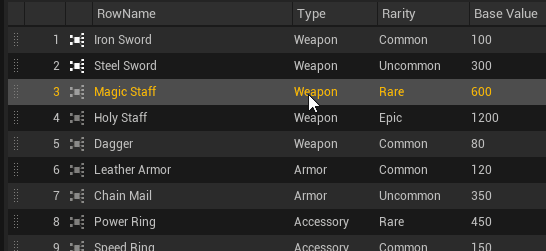
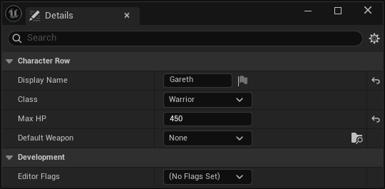
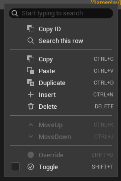
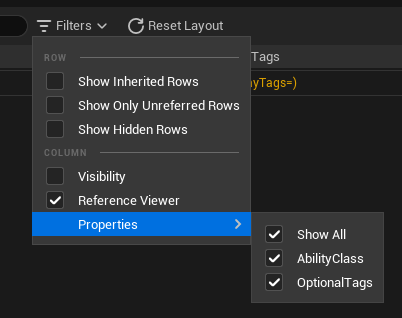
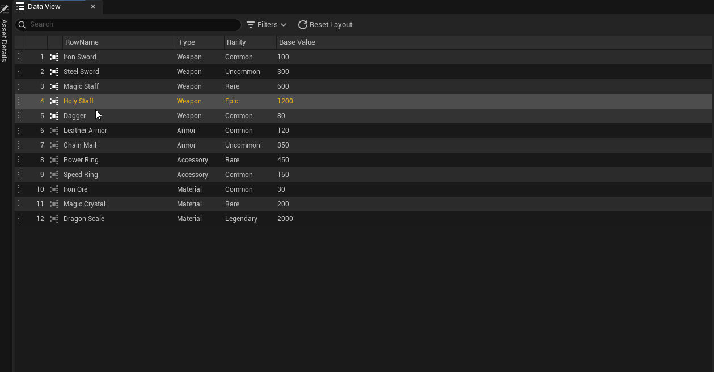
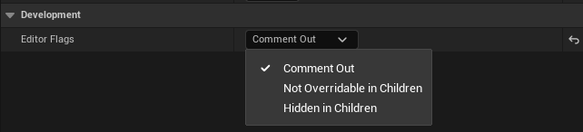
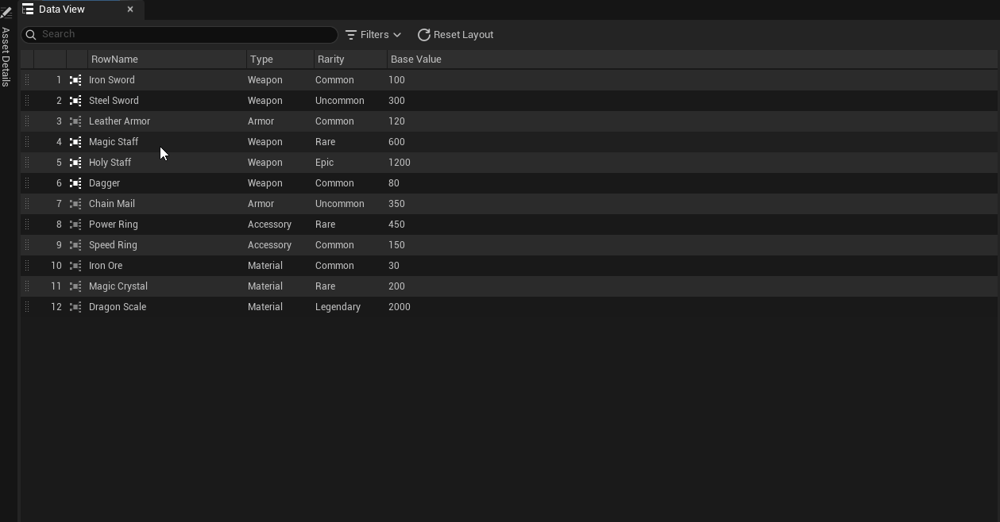
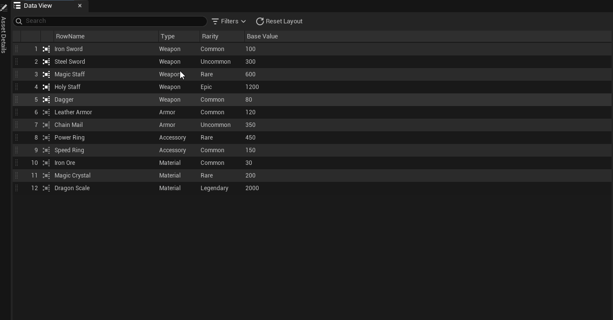
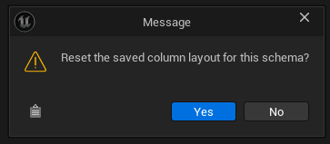

# Data View

Data View はRepository エディタの中央パネルです。行をグリッド形式で表示し、各カラムが行構造体のプロパティに対応します。

## エディタレイアウト

Repository エディタは 3 つのパネルで構成されます。

| パネル | 位置 | 役割 |
|--------|------|------|
| アセット Details | 左 | Repositoryレベルのプロパティ（Schema Class、Parent Repositories） |
| Data View | 中央 | 行グリッド — 行の追加・削除・編集 |
| Selection Details | 右 | 選択行のフルプロパティエディタ |

## 行の追加

ツールバーの **Insert** をクリックするか、`Ctrl+N` を押します。以下の状態で新しい行が作成されます。

- 新たに生成された `FDataIndexerPrimaryKey`（GUID）
- 行構造体のすべてのプロパティがデフォルト構築された値

新しい行は Data View の末尾に表示されます。

## 行の削除

Data View で 1 つ以上の行を選択してから：

- `Delete` キーを押す、または
- 右クリック → **Delete**

!!! warning "削除は恒久的"
    行を削除するとそのPrimaryKeyが削除されます。参照されている行を削除しようとすると確認ダイアログが表示されます。参照ビューアボタンがアクティブな行は、削除前に参照先を確認してください。

## 選択モード

Data View は**行選択モード**と**セル選択モード**の 2 種類をサポートします。選択範囲はハイライト枠で表示されます。

| 操作 | 結果 |
|------|------|
| データセルをクリック | **行選択モード** — その行を選択 |
| クリック + ドラッグ | 行範囲を選択 |
| Shift+クリック | アンカー行から行範囲を拡張 |
| Ctrl+クリック（データセル） | **セル選択モード** — そのセルをトグル（追加 / 解除） |
| Ctrl+ドラッグ | 矩形セル範囲をトグル |
| Shift+クリック（セル選択中） | アンカーセルから矩形範囲を拡張 |
| ダブルクリック | そのセルのインライン編集モードに入る |
| Escape | インライン編集モードを終了 |

固定カラム（ドラッグハンドル等）のクリックは常に行選択モードになります。選択可能なセルにホバーするとカーソルが十字形に変わります。

右の **Selection Details** パネルは選択行のプロパティを表示します。

## 行の編集

行の編集方法は 2 通りあります。

**インライン編集（Data View）**
: グリッドのセルを**ダブルクリック**します。単純なスカラープロパティ・enum・短い文字列はインライン編集に対応しています。**Escape** を押すと編集を終了し、別のセルをクリックすると確定して移動します。

**Selection Details（フルエディタ）**
: 右クリック → **Select Row** を選ぶか、ドラッグハンドルカラムをクリックして行を選択します。右の **Selection Details** パネルにフルプロパティエディタが表示されます。

## コンテキストメニュー

右クリックする場所によって 2 種類のコンテキストメニューが表示されます。

### セルコンテキストメニュー

**Ctrl+右クリック**で未選択データセルを選択（セル選択モード）するか、すでにセルを選択している状態で右クリックします。

| 項目 | ショートカット | 説明 |
|------|--------------|------|
| **Copy** | `Ctrl+C` | 選択セル範囲をタブ区切りテキストとしてコピー |
| **Paste** | `Ctrl+V` | セル値を選択範囲にペースト |
| **Select Row** | — | 選択セルを含む行全体に選択を拡張 |

### 行コンテキストメニュー

**ドラッグハンドルカラム**を右クリックするか、データセルを（Ctrl なしで）右クリック、または行選択中に右クリックします。

| 項目 | ショートカット | 説明 |
|------|--------------|------|
| **Copy ID** | — | 選択行のPrimaryKey（GUID）をクリップボードにコピー |
| **Search this row** | — | この行のデータをグリッド内で検索 |
| **Copy** | `Ctrl+C` | 選択行をコピー |
| **Paste** | `Ctrl+V` | コピーした行データを選択行にペースト |
| **Duplicate** | `Ctrl+D` | 選択行を複製して末尾に追加 |
| **Insert** | `Ctrl+N` | 新しい行を追加 |
| **Delete** | `Delete` | 選択行を削除 |
| **MoveUp** | `Ctrl+K` | 選択行を 1 つ上に移動 |
| **MoveDown** | `Ctrl+J` | 選択行を 1 つ下に移動 |
| **Override** | `Shift+O` | 親Repositoryの行をこのRepositoryでオーバーライド |
| **Toggle** | `Shift+T` | DevOnlyRow フラグを切り替え |

## コピーとペースト

コピー/ペーストの動作は選択モードによって異なります。

**行コピー/ペースト**（行全体を選択中）：

- `Ctrl+C` で行構造体（全プロパティ）をコピーします。
- `Ctrl+V` でコピーした行データをすべての選択行にペーストします。クリップボードに複数行がある場合は先頭選択行から下方向に順に書き込みます。

**セルコピー/ペースト**（セルを選択中）：

- `Ctrl+C` で選択した矩形範囲をタブ区切りテキストとしてコピーします。選択が矩形でない場合は通知が表示されます。
- `Ctrl+V` で現在の選択範囲の左上を起点にセル値をペーストします。カラム名がコピー元と完全に一致している必要があります。クリップボードが 1 行の場合は選択行すべてに同じ値を書き込みます。

!!! note "クリップボード形式の不一致"
    行データをセル選択にペースト（またはセルデータを行選択にペースト）しようとすると、通知を表示して中断します。2 つのクリップボード形式は互換性がありません。

## Row Name

各行の先頭カラムに表示されるラベルです。DataTable の RowName とは異なり、このカラムは直接編集できません。

表示される値はSchemaで実装した `DisplayName` によって決まります。フォーマットは実装側で自由に定義できます（例: ID のゼロ埋め、複数プロパティの連結など）。

Row Name の重複は可能ですが、視認性が下がるため推奨しません。

## カラムレイアウト

どのプロパティをカラムとして表示するかはSchemaの **Expanded Struct Entries** 設定で制御されます。

- `RowStruct` の中で `ExpandedStructEntries` に列挙されているプロパティが個別カラムとして表示されます。
- ネスト構造体のプロパティは、その構造体型を `ExpandedStructEntries` に追加することで独立したカラムに展開できます。
- 展開セットに含まれないプロパティはグリッドで結合テキストセルとして表示されますが、Selection Details パネルでは完全に編集できます。

## フィルター

ツールバーの **フィルター** ドロップダウンで表示する行・カラムを絞り込めます。

### ROW フィルター

| オプション | 説明 |
|-----------|------|
| **Show Inherited Rows** | 親から継承しこのRepositoryで上書きした行について、上書き元の行を表示します。 |
| **Show Only Unreferred Rows** | どこからも参照されていない行のみ表示します。未使用データの整理に役立ちます。 |
| **Show Hidden Rows** | 親Repositoryで `Hidden in Children` に設定され非表示になった行を表示します。 |

### COLUMN フィルター

| オプション | 説明 |
|-----------|------|
| **Visibility** | 各行の Editor Flags 状態を示す Visibility カラムを表示/非表示 |
| **Reference Viewer** | 参照状態アイコンと参照ビューアボタンのカラムを表示/非表示 |
| **Properties** | 表示するプロパティカラムを個別に制御するサブメニュー。**Show All** で全カラムを一括表示。 |

## 継承行

継承行は子Repositoryでは編集できません — ダブルクリックで親アセットに移動します。

**Override**（`Shift+O`）を実行すると、親行の値をコピーした状態でこのRepositoryに行が追加され、独立して編集できるようになります。

## 参照ビューア

各行の左端に参照状態アイコンが表示されます。アイコンをクリックすると UE5 の **Reference Viewer** が開き、その行を参照しているアセットを一覧できます。

- アイコンが**アクティブ**な行 — いずれかのアセットから参照されています
- アイコンが**非アクティブ**な行 — どこからも参照されていません

!!! tip "データ整理に最適"
    **フィルター → Show Only Unreferred Rows** と組み合わせることで、未使用の行を一覧して不要なデータを安全に削除できます。

## Editor Flags

Selection Details パネルの **Development** カテゴリに **Editor Flags** プロパティがあります。行ごとに開発用フラグをビットフラグで設定できます。

| フラグ | 説明 |
|-------|------|
| **Comment Out** | 行を無効化します。ゲームランタイムには含まれませんが、データは保持されます。一時的に除外したい行に使います。 |
| **Not Overridable in Children** | 子Repositoryがこの行を Override できなくなります。親で固定したい行に設定します。 |
| **Hidden in Children** | 子Repositoryの Data View にこの行を表示しません。子が誤って参照・編集するのを防ぎます。 |

複数フラグの同時設定が可能です。フラグなしの状態は **No Flags Set** と表示されます。

行左端の **ドラッグハンドル**（`⠿` アイコン）をドラッグしても並び替えができます。

## カラム幅と並び順

カラムの幅と並び順はエディタ設定の **Schema Layouts** にSchemaごとに保存されます。カラムヘッダーをドラッグして並び替えられます。カラムヘッダー間の仕切りをドラッグしてリサイズできます。

### Reset Layout

ツールバーの **Reset Layout** ボタンをクリックすると、このSchemaのカラム幅・並び順の保存データをすべてリセットします。

確認ダイアログで **Yes** を選択するとリセットが実行されます。Schemaのデフォルトカラム構成に戻り、幅・順序の変更はすべて失われます。
