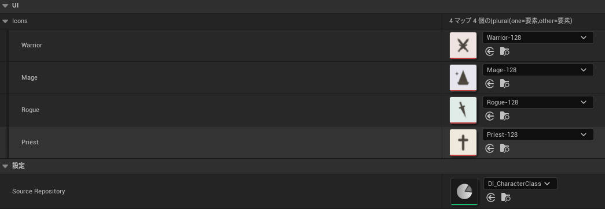

# Driven Collection

`UDataIndexerDrivenCollection` is an abstract `UDataAsset` base class for editor assets that manage per-key sub-assets — such as icons, ability class references, or other `UObject` pointers — keyed by `FDataIndexerPrimaryKey`. Entries are automatically synchronized with a source repository.

!!! note "C++ required"
    Using this feature requires C++ subclassing. Blueprint subclassing is not supported — the entry builder pattern requires C++ template instantiation.

## Concept

A driven collection is a companion asset to a `UDataIndexerRepository`. It maintains a `TMap` keyed by the same `FDataIndexerPrimaryKey` set as the repository, where each value is an asset or struct that cannot or should not live inside the row data itself. When rows are added or removed from the source repository in the editor, the collection rebuilds its entries automatically.

**Typical use cases:**

- Per-row asset references that don't belong in row data (e.g., icons, meshes, ability classes). Separating asset references lets you manage hard-reference loading independently from row data.
- Data settings for a row list including parent rows.

As an example, `CharacterClassIconCollection` maps one icon texture to each class (Warrior / Mage / Rogue / Priest) in the `DI_CharacterClass` repository. The keys are read-only, resolve to display names, and stay in sync with the `Source Repository` rows.



## SourceRepository

```cpp
UPROPERTY(EditDefaultsOnly, Category = Settings)
TObjectPtr<UDataIndexerRepository> SourceRepository;
```

Set this in the asset's details panel. When `SourceRepository` is saved or loaded in the editor, the collection calls `Rebuild()` on its `EntryBuilder`.

!!! warning "Editor-only rebuild"
    The rebuild mechanism (`TEntryBuilder`, `PostEditChangeProperty`, asset load delegates) is entirely `WITH_EDITOR`. The collection's data is baked into the asset at save time and accessed at runtime via normal UPROPERTY serialization — there is no runtime dependency on the repository.

## Subclassing in C++

Implement a `TEntryBuilder<TValue>` and assign it in the constructor:

```cpp
// MyDrivenCollection.h
UCLASS()
class UMyDrivenCollection : public UDataIndexerDrivenCollection
{
    GENERATED_BODY()

public:
    UMyDrivenCollection();

    UPROPERTY(EditDefaultsOnly, EditFixedSize,
        meta = (ReadOnlyKeys, Repository = "SourceRepository"))
    TMap<FDataIndexerPrimaryKey, FMyCurveData> Entries;

#if WITH_EDITOR
private:
    class FMyEntryBuilder : public TEntryBuilder<FMyCurveData>
    {
    public:
        explicit FMyEntryBuilder(UMyDrivenCollection& Asset)
            : TEntryBuilder(Asset) {}

    private:
        virtual TMap<FDataIndexerPrimaryKey, FMyCurveData>& GetEntries() const override
        {
            return GetAsset<UMyDrivenCollection>().Entries;
        }

        virtual FMyCurveData GetDefaultValue(const FDataIndexerPrimaryKey& Key) const override
        {
            return FMyCurveData{};
        }
    };
#endif
};

// MyDrivenCollection.cpp
UMyDrivenCollection::UMyDrivenCollection()
{
#if WITH_EDITOR
    EntryBuilder = MakeShared<FMyEntryBuilder>(*this);
#endif
}
```

!!! warning "Required entry-map metadata"
    The entry `TMap` **must** carry these specifiers, or the details panel will not work correctly:

    | Specifier | Effect if missing |
    | --- | --- |
    | `meta = (Repository = "SourceRepository")` | Key cells cannot resolve the owning repository, so keys render blank / `None` instead of their display names. |
    | `meta = (ReadOnlyKeys)` | Keys become editable selectors instead of read-only labels, letting users desync the map from the repository-driven key set. |
    | `EditFixedSize` | Users can manually add/remove map entries, which conflicts with `Rebuild()` owning the entry set. |

    The `Repository` value is a property path resolved against the asset — point it at the `SourceRepository` property declared in the base class.

## Rebuild behavior

`TEntryBuilder<TValue>::Rebuild()` performs a stable merge:

1. Iterates all primary keys from `SourceRepository`
2. Removes entries whose keys no longer exist in the repository
3. Adds default-constructed entries for new keys
4. Stable-sorts entries to match the repository's row order

Existing entries whose keys are still present are left untouched — their values survive the rebuild.

## Runtime access

The collection's entry map is baked into the asset and serialized like any other UPROPERTY, so it can be read at runtime without the source repository. Expose a `BlueprintCallable` getter that looks up a value by `FDataIndexerPrimaryKey`, and mark the class `BlueprintType` so Blueprints can hold a reference to the asset:

```cpp
UCLASS(BlueprintType)
class UMyDrivenCollection : public UDataIndexerDrivenCollection
{
    GENERATED_BODY()

public:
    UFUNCTION(BlueprintCallable, Category = UI)
    TSoftObjectPtr<UTexture2D> GetIcon(const FDataIndexerPrimaryKey& Key) const;

    // ... entry map and editor builder as above ...
};

// .cpp
TSoftObjectPtr<UTexture2D> UMyDrivenCollection::GetIcon(const FDataIndexerPrimaryKey& Key) const
{
    return Entries.FindRef(Key); // empty soft pointer when Key has no entry
}
```

!!! tip "Soft references"
    Returning the `TSoftObjectPtr` rather than a loaded `UTexture2D*` keeps load timing in the caller's hands — the whole point of storing asset references outside the row data. Callers can `LoadSynchronous()` or async-load as needed.
