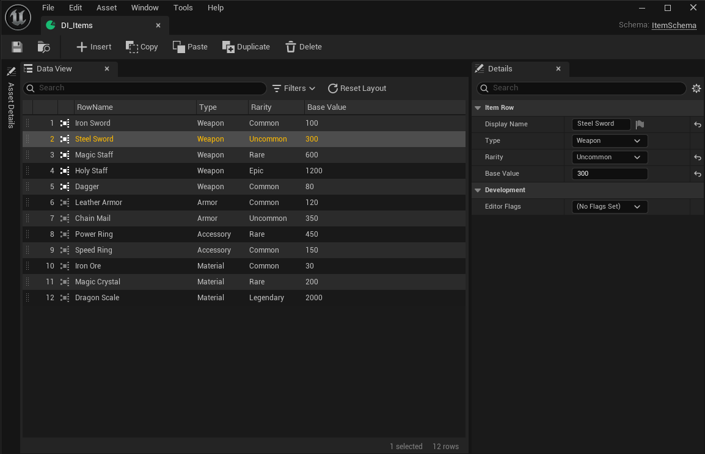

# エディタガイド

`DataIndexerEd` モジュールはランタイムアセット型の上にカスタムエディタワークフローを追加します。Schemaの定義・Repository の作成・行データのオーサリングをコードなしで行えます。

!!! note "エディタ専用"
    このセクションのすべての機能は Unreal Editor が必要です。`DataIndexerEd` モジュールは `UncookedOnly` で宣言されており、パッケージビルドでは使用できません。

## エディタレイアウト

Repository アセットをダブルクリックすると 3 パネル構成のエディタが開きます。

| パネル | 位置 | 役割 |
|-------|------|------|
| アセット Details | 左（デフォルト非表示、左サイドにドック済み） | Schema Class・Parent Repositories などRepositoryレベルのプロパティ |
| Data View | 中央 | 行グリッド — 追加・削除・インライン編集 |
| Selection Details | 右 | 選択行のフルプロパティエディタ |

## このセクションのページ

- :material-folder-plus:{ .lg .middle } &nbsp; **[アセット Creation](asset-creation.md)**

    ---

    Blueprint 構造体と Schema Blueprint の作成、Repository アセットの作成とSchemaのバインド。親 Repository の設定による行継承の手順も解説。

- :material-table-eye:{ .lg .middle } &nbsp; **[Data View](data-view.md)**

    ---

    3 パネル構成のカスタムエディタ。行の追加・編集・削除、表示カラムの設定、親・子 Repository 間のナビゲーション。

- :material-code-json:{ .lg .middle } &nbsp; **[JSON サポート](json-support.md)**

    ---

    コードレビュー向け差分対応 JSON へのエクスポートと、マージ操作としての JSON インポート。

- :material-layers-triple:{ .lg .middle } &nbsp; **[Driven Collection](driven-collection.md)**

    ---

    `UDataIndexerDrivenCollection` — `FDataIndexerPrimaryKey` をキーとするサブアセット（アイコン・アビリティクラス等）を管理する C++ エディタアセット基底クラス。

