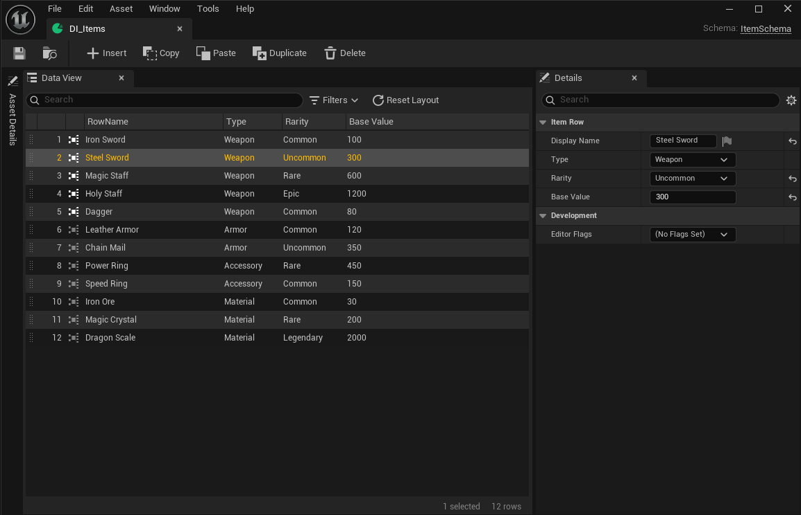

---
hide:
  - navigation
---

# Editor Guide

The `DataIndexerEd` module adds a custom editing workflow on top of the runtime asset types. Use the editor to define schemas, create repositories, and author row data — no code required.

!!! note "Editor-only"
    Everything in this section requires Unreal Editor. The `DataIndexerEd` module is declared `UncookedOnly` and is not available in packaged builds.

## Editor layout

Double-clicking a Repository asset opens a three-panel editor.

| Panel | Position | Role |
|-------|----------|------|
| Asset Details | Left (hidden by default, docked to left side) | Repository-level properties: Schema Class, Parent Repositories, etc. |
| Data View | Center | Row grid — add, delete, and edit rows inline |
| Selection Details | Right | Full property editor for the selected row |

## Pages in this section

- :material-folder-plus:{ .lg .middle } &nbsp; **[Asset Creation](asset-creation.md)**

    ---

    Create the Blueprint struct and Schema Blueprint, create the Repository asset, and bind the schema. Also covers setting up parent repositories for inherited rows.

- :material-table-eye:{ .lg .middle } &nbsp; **[Data View](data-view.md)**

    ---

    The three-panel custom editor. Insert, edit, and delete rows; configure which columns appear; navigate between parent and child repositories.

- :material-table-cog:{ .lg .middle } &nbsp; **[Custom Cell Widgets](custom-cell-widgets.md)**

    ---

    Replace default cell widgets with custom displays or inline editors, and declare virtual columns that alias a property under multiple presentations.

- :material-code-json:{ .lg .middle } &nbsp; **[JSON Support](json-support.md)**

    ---

    Export row data to a diff-friendly JSON format for code review, and import JSON back as a merge operation.

- :material-layers-triple:{ .lg .middle } &nbsp; **[Driven Collection](driven-collection.md)**

    ---

    `UDataIndexerDrivenCollection` — C++ base class for editor assets that manage per-key sub-assets (icons, ability classes, etc.) keyed by `FDataIndexerPrimaryKey`.

