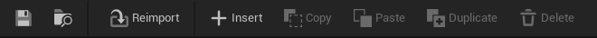

# JSON Support

DataIndexer repositories support JSON export, import, and diff. All operations are accessed from the Content Browser context menu.

## Exporting

1. Right-click a repository asset in the Content Browser
2. Select **Export JSON**
3. Choose a destination path

The exported file contains a JSON array of row objects:

```json
[
  {
    "PrimaryKey": "A1B2C3D4-E5F6-7890-ABCD-EF1234567890",
    "RowEntity": {
      "DisplayName": "Iron Sword",
      "MaxStack": 1,
      "Category": "Weapon"
    },
    "EditorFlags": 0
  },
  {
    "PrimaryKey": "B2C3D4E5-F6A7-8901-BCDE-F12345678901",
    "RowEntity": {
      "DisplayName": "Health Potion",
      "MaxStack": 10,
      "Category": "Consumable"
    },
    "EditorFlags": 0
  }
]
```

**Key points:**

- `PrimaryKey` is the row's `FDataIndexerPrimaryKey` as a GUID string
- `RowEntity` is the row struct serialized using UE's JSON property serialization
- `EditorFlags` is a bitmask of editor-only row state (e.g. commented-out, hidden in children); `0` means none
- The export includes only local rows — parent repository rows are not exported

## Importing

1. Right-click a repository asset in the Content Browser
2. Select **Import JSON**
3. Select a JSON file

The import performs a **full replacement** — all existing rows are deleted and replaced with the contents of the JSON file.

The format is auto-detected: files with a `RowEntity` field are read as native DataIndexer JSON, while flat row objects are treated as DataTable JSON. See [Migrate from DataTable](../how-to/migrate-from-datatable.md) for the DataTable path.

## Reimport

A repository open in the custom editor can be reimported from the toolbar **Reimport** button.



- If a source file is already recorded: reimports from that file automatically
- If no source file is recorded: opens a file selection dialog (same behavior as Import JSON)

After reimport, the data view refreshes automatically.

## Diff Workflow

With VCS integration (Perforce or Git) configured, you can visually diff revisions directly from the Content Browser.

1. Right-click a repository asset in the Content Browser
2. Select **Source Control** → **Diff Against Depot** (Perforce) or **Diff Against Revision** (Git)

DataIndexer exports both revisions as temporary JSON files and launches the configured text diff tool (Beyond Compare, WinMerge, etc.) to display the diff.

Set the diff tool path in **Editor Preferences → General → Source Control → Text Diff Tool Path**.