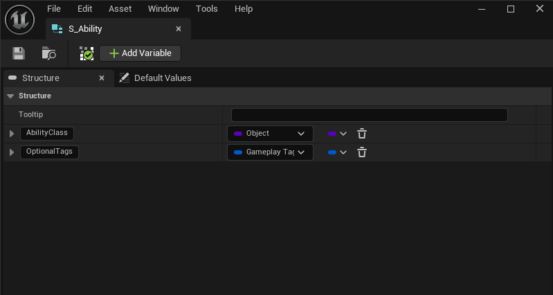
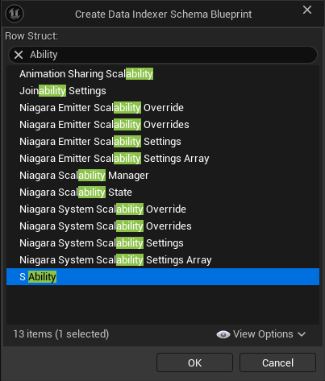
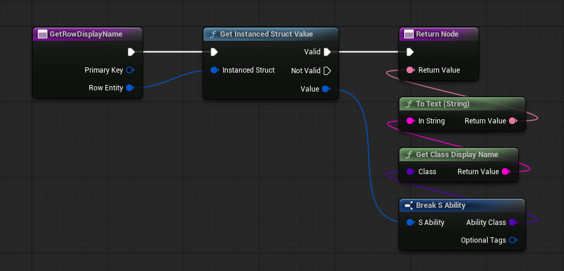
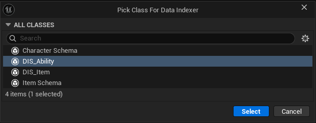
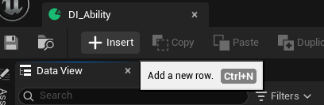

# クイックスタート

スキーマと Repository の作成から行のオーサリング、ランタイムでのクエリまでを一通り説明します。

## ウォークスルー

=== "エディタ & Blueprint"

    **1. Blueprint 構造体を作成**

    行データの形状を Blueprint 構造体として Content Browser で定義します。

    

    1. **Content Browser** で右クリック → **Blueprints → Structure**
    2. 名前を付け（例：`S_ItemRow`）、ダブルクリックで開く
    3. データフィールドごとに変数を追加 — `DisplayName`（Text）、`Type`（列挙型）、`BaseValue`（Integer）など

    **2. Schema Blueprint を作成**

    Schema Blueprint は構造体を Repository に紐付け、エディタの動作を制御します。

    1. 右クリック → **Blueprint Class**、`DataIndexerSchema` を検索して選択
    2. 名前を付け（例：`BP_ItemSchema`）、ダブルクリックで開く
    3. **Class Defaults → Row Struct** に作成した構造体（`S_ItemRow`）を設定

    

    **Get Row Display Name** を実装すると、Data View に各行の読みやすいラベルを表示できます：

    

    **3. Repository を作成**

    1. 右クリック → **Miscellaneous → Data Asset**、`DataIndexerRepository` を選択
    2. 名前を付け（例：`DI_Items`）、ダブルクリックで開く
    3. **Details** パネルの **Schema Class** にスキーマ（例：`BP_ItemSchema`）を設定

    

    !!! warning "スキーマのバインドは変更不可"
        行を追加する前に **Schema Class** を設定してください。後から変更すると既存の行データがすべて無効になります。

    **4. 行をオーサリング**

    Repository アセットをダブルクリックすると Data View が開きます。

    

    - **Insert** キーで行を追加 — GUID のプライマリキーが自動生成されます
    - グリッドでインライン編集するか、行を選択して右側の **Selection Details** パネルで編集
    - **保存** — 逆引きテーブルが自動再構築されます

    エディタの詳細は [エディタガイド](editor-guide/index.md) を参照してください。

    **5. Blueprint からクエリ**

    **特定の行を参照する**

    Actor またはコンポーネントに `FDataIndexerRowHandle` 変数を宣言します。Details パネルで Repository の特定の行を設定します。

    Blueprint グラフでは **Get Row** ノードを使います：

    1. 行ハンドル変数からドラッグして **Get Row** を検索
    2. ノードの Details パネルで **Schema Class** にスキーマを設定
    3. `Row` 出力ピンが構造体型に解決されます — ロジックに接続して使います

    **全行を反復する**

    DataIndexer 関数ライブラリの **Get All Primary Keys** に Repository を渡すと全プライマリキーが取得できます。各キーに対して **Get Row** を呼び出して行データを取得します。

    インデックスによるフィルタリングは [Blueprint API → 関数ライブラリ](blueprint-api/function-library.md) を参照してください。

=== "C++"

    **1. 行構造体の定義**

    行データを格納する構造体と、型安全なクエリ用のエイリアスを宣言します：

    ```cpp title="ItemTypes.h"
    #pragma once
    #include "DataIndexerSchemaInterface.h"
    #include "ItemTypes.generated.h"

    UENUM(BlueprintType)
    enum class EItemType : uint8
    {
        Weapon, Armor, Accessory, Material,
    };

    UENUM(BlueprintType)
    enum class EItemRarity : uint8
    {
        Common, Uncommon, Rare, Epic, Legendary,
    };

    USTRUCT(BlueprintType)
    struct FItemRow
    {
        GENERATED_BODY()

        UPROPERTY(EditAnywhere, BlueprintReadOnly)
        FText DisplayName;

        UPROPERTY(EditAnywhere, BlueprintReadOnly)
        EItemType Type = EItemType::Weapon;

        UPROPERTY(EditAnywhere, BlueprintReadOnly)
        EItemRarity Rarity = EItemRarity::Common;

        UPROPERTY(EditAnywhere, BlueprintReadOnly)
        int32 BaseValue = 0;
    };

    using FItemInterface = DataIndexer::TNativeSchemaInterface<FItemRow>;
    ```

    別のリポジトリの行を `FDataIndexerRowHandle` で参照する構造体：

    ```cpp title="CharacterTypes.h"
    USTRUCT(BlueprintType)
    struct FCharacterRow
    {
        GENERATED_BODY()

        UPROPERTY(EditAnywhere, BlueprintReadOnly)
        FText DisplayName;

        UPROPERTY(EditAnywhere, BlueprintReadOnly)
        ECharacterClass Class = ECharacterClass::Warrior;

        UPROPERTY(EditAnywhere, BlueprintReadOnly)
        int32 MaxHP = 100;

        // ItemRepository へのクロスリポジトリ参照
        UPROPERTY(EditAnywhere, BlueprintReadOnly, meta = (Schema = "/Script/YourGame.ItemSchema"))
        FDataIndexerRowHandle DefaultWeapon;
    };

    using FCharacterInterface = DataIndexer::TNativeSchemaInterface<FCharacterRow>;
    ```

    **2. C++ スキーマの実装**

    スキーマは行構造体を Repository にバインドし、インデックスビルダーを登録します。`DI_DEFINE_INDEX` で各インデックスを宣言します（クラスパスから決定論的な GUID を生成）：

    ```cpp title="ItemSchema.h"
    #pragma once
    #include "DataIndexerKeyHelpers.h"
    #include "DataIndexerSchema.h"
    #include "ItemSchema.generated.h"

    UCLASS()
    class UItemSchema : public UDataIndexerSchema
    {
        GENERATED_BODY()

    public:
        DI_DEFINE_INDEX(ByTypeIndex);
        DI_DEFINE_INDEX(ByRarityIndex);
        DI_DEFINE_INDEX(ByTypeAndRarityIndex);

    protected:
        virtual void PostInitProperties() override;

        virtual FText GetRowDisplayName_Implementation(
            const FDataIndexerPrimaryKey& PrimaryKey, const FInstancedStruct& RowEntity) const override;

        UFUNCTION()
        static FGuid BuildTypeIndex(const FInstancedStruct& RowEntity, FText& OutDisplayName);

        UFUNCTION()
        static FGuid BuildRarityIndex(const FInstancedStruct& RowEntity, FText& OutDisplayName);

        UFUNCTION()
        static FGuid BuildTypeAndRarityIndex(const FInstancedStruct& RowEntity, FText& OutDisplayName);
    };
    ```

    `PostInitProperties` でビルダーを登録：

    ```cpp title="ItemSchema.cpp"
    #include "ItemSchema.h"
    #include "ItemTypes.h"

    void UItemSchema::PostInitProperties()
    {
        if (HasAnyFlags(RF_ClassDefaultObject))
        {
            RowStruct = FItemRow::StaticStruct();

            RegisterFunction_BuildIndex(ByTypeIndex(),          GET_FUNCTION_NAME_CHECKED(ThisClass, BuildTypeIndex));
            RegisterFunction_BuildIndex(ByRarityIndex(),        GET_FUNCTION_NAME_CHECKED(ThisClass, BuildRarityIndex));
            RegisterFunction_BuildIndex(ByTypeAndRarityIndex(), GET_FUNCTION_NAME_CHECKED(ThisClass, BuildTypeAndRarityIndex));
        }
        Super::PostInitProperties();
    }

    FGuid UItemSchema::BuildTypeIndex(const FInstancedStruct& RowEntity, FText& OutDisplayName)
    {
        if (const FItemRow* Row = RowEntity.GetPtr<const FItemRow>())
        {
            OutDisplayName = UEnum::GetDisplayValueAsText(Row->Type);
            return FGuid(static_cast<uint32>(Row->Type), 0, 0, 0);
        }
        return {};
    }
    ```

    !!! tip "Blueprint スキーマ"
        プロトタイプ段階では `UDataIndexerSchema` を Blueprint でサブクラス化し、**Class Defaults → Build Index Functions** からインデックス関数を登録できます。サブシステムでコンパイル時アクセスが必要になったら C++ スキーマに移行してください。

    **3. ゲームシングルトンの設定**

    推奨パターンは `UObject` シングルトンを通じてリポジトリ参照を公開し、`DefaultEngine.ini` で設定します：

    ```cpp title="GameDataSettings.h"
    UCLASS()
    class UGameDataSettings : public UObject
    {
        GENERATED_BODY()
    public:
        static const UGameDataSettings* Get();

        UPROPERTY(EditAnywhere, BlueprintReadOnly, Category = GameData,
            meta = (Schema = "/Script/YourGame.ItemSchema"))
        TObjectPtr<UDataIndexerRepository> ItemRepository;

        UPROPERTY(EditAnywhere, BlueprintReadOnly, Category = GameData,
            meta = (Schema = "/Script/YourGame.CharacterSchema"))
        TObjectPtr<UDataIndexerRepository> CharacterRepository;
    };
    ```

    ```ini title="Config/DefaultEngine.ini"
    [/Script/Engine.Engine]
    GameSingletonClassName=/Script/YourGame.GameDataSettings
    ```

    `GameDataSettings` のクラスデフォルトを開き、次のステップで作成する 2 つの Repository アセットを割り当てます。

    **4. Repository アセットの作成**

    1. Content Browser で右クリック → **Miscellaneous → Data Asset**
    2. アセットクラスとして `DataIndexerRepository` を選択
    3. 名前を付け（例：`DI_Items`）、ダブルクリックで開く
    4. Details パネルの **Schema Class** にスキーマ（例：`ItemSchema`）を設定

    エディタのワークフロー全体は [エディタガイド](editor-guide/index.md) を参照してください。

    **5. 行のオーサリング**

    Repository アセットをダブルクリックしてカスタムエディタを開きます。

    - **Insert** キーで行を追加 — `FDataIndexerPrimaryKey`（GUID）が自動生成されます
    - Data View グリッドでプロパティを直接編集
    - **Schema** が表示名とカラム構成を制御します

    **6. C++ からのクエリ**

    `UEngineSubsystem`（またはシングルトンにアクセスできる任意のクラス）でリポジトリアクセスをラップします：

    ```cpp
    // 順引き — 指定タイプのアイテムをすべて取得
    TArray<FDataIndexerPrimaryKey> UGameDataSubsystem::GetItemsByType(EItemType Type) const
    {
        const UGameDataSettings* Settings = UGameDataSettings::Get();
        if (!Settings || !Settings->ItemRepository) return {};

        FItemRow Query;
        Query.Type = Type;
        return FItemInterface::GetPrimaryKeys(*Settings->ItemRepository, UItemSchema::ByTypeIndex(), Query);
    }

    // 複合インデックス — タイプとレアリティの同時指定
    TArray<FDataIndexerPrimaryKey> UGameDataSubsystem::GetItemsByTypeAndRarity(EItemType Type, EItemRarity Rarity) const
    {
        FItemRow Query;
        Query.Type   = Type;
        Query.Rarity = Rarity;
        return FItemInterface::GetPrimaryKeys(*Settings->ItemRepository, UItemSchema::ByTypeAndRarityIndex(), Query);
    }

    // 逆引き — 特定のアイテムを DefaultWeapon に持つキャラクターを取得
    TArray<FDataIndexerPrimaryKey> UGameDataSubsystem::GetCharactersUsingWeapon(const FDataIndexerPrimaryKey& WeaponKey) const
    {
        FCharacterRow Query;
        Query.DefaultWeapon.PrimaryKey = WeaponKey;
        return FCharacterInterface::GetPrimaryKeys(*Settings->CharacterRepository,
            UCharacterSchema::ByDefaultWeaponIndex(), Query);
    }

    // A→B リレーション — キャラクターの DefaultWeapon から FItemRow を解決
    TConstStructView<FItemRow> UGameDataSubsystem::GetDefaultWeapon(const FDataIndexerPrimaryKey& CharacterKey) const
    {
        TConstStructView<FCharacterRow> Character =
            FCharacterInterface::FindRow(*Settings->CharacterRepository, CharacterKey);
        if (!Character.IsValid()) return {};

        return FItemInterface::FindRow(*Settings->ItemRepository, Character.Get().DefaultWeapon.PrimaryKey);
    }
    ```

---

## 次のステップ

- [コアコンセプト](concepts/index.md) — Repository・Schema・キー・インデックスの関係を理解する
- [エディタガイド](editor-guide/index.md) — エディタワークフローの完全リファレンス
- [Blueprint API](blueprint-api/index.md) — Blueprint ノードと関数ライブラリのリファレンス
- [C++ API](cpp-api/index.md) — 型安全な C++ アクセスパターン
