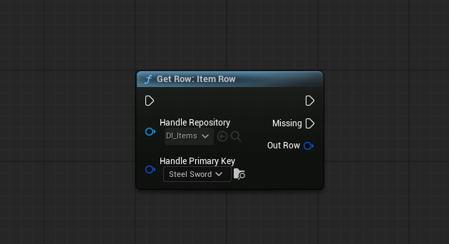
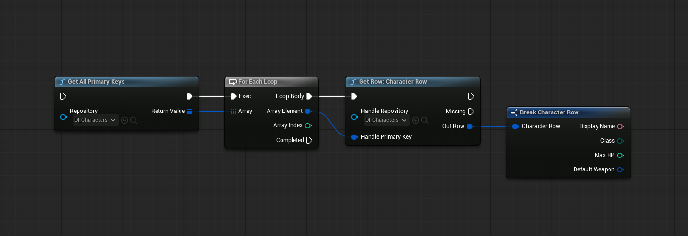

# Quick Start

A complete walkthrough — from creating a schema and repository to authoring rows and querying them at runtime.

!!! tip "Prerequisites"
    - Unreal Engine 5.7 or later
    - DataIndexer plugin enabled — see [Working with Plugins in Unreal Engine](https://dev.epicgames.com/documentation/unreal-engine/working-with-plugins-in-unreal-engine) for setup instructions.

---

## 1. Create a Struct and Schema

=== ":material-puzzle: Editor & Blueprint"

    **Create a Blueprint Struct**{ .step-label }

    Define the shape of a single row as a Blueprint struct in the Content Browser.

    

    1. Right-click in the **Content Browser** → **Blueprints → Structure**
    2. Name it (e.g., `S_ItemRow`) and double-click to open
    3. Add a variable for each data field — `DisplayName` (Text), `Type` (Enum), `BaseValue` (Integer), etc.

    **Create a Schema Blueprint**{ .step-label }

    A Schema Blueprint links your struct to a repository and controls editor behavior.

    1. Right-click → **Blueprint Class**, search for `DataIndexerSchema`, select it
    2. Name it (e.g., `BP_ItemSchema`) and open it
    3. In **Class Defaults → Row Struct**, select your struct (`S_ItemRow`)

    

    Optionally implement **Get Row Display Name** to show a readable label per row in the Data View:

    

    !!! note
        This logic handles the per-row display equivalent of DataTable's RowName. Rows are automatically renamed by referencing this function, keeping labels always in sync.

=== ":material-language-cpp: C++"

    **Define a Row Struct**{ .step-label }

    Declare the struct that holds row data and a type alias for the native schema interface:

    ```cpp title="ItemTypes.h"
    #pragma once
    #include "DataIndexerSchemaInterface.h"
    #include "ItemTypes.generated.h"

    UENUM(BlueprintType)
    enum class EItemType : uint8
    {
        Weapon, Armor, Accessory, Material,
    };

    UENUM(BlueprintType)
    enum class EItemRarity : uint8
    {
        Common, Uncommon, Rare, Epic, Legendary,
    };

    USTRUCT(BlueprintType)
    struct FItemRow
    {
        GENERATED_BODY()

        UPROPERTY(EditAnywhere, BlueprintReadWrite)
        FText DisplayName;

        UPROPERTY(EditAnywhere, BlueprintReadWrite)
        EItemType Type = EItemType::Weapon;

        UPROPERTY(EditAnywhere, BlueprintReadWrite)
        EItemRarity Rarity = EItemRarity::Common;

        UPROPERTY(EditAnywhere, BlueprintReadWrite)
        int32 BaseValue = 0;
    };

    using FItemInterface = DataIndexer::TNativeSchemaInterface<FItemRow>;
    ```

    **Implement a C++ Schema**{ .step-label }

    Set `RowStruct` and implement `GetRowDisplayName`:

    ```cpp title="ItemSchema.h"
    #pragma once
    #include "DataIndexerSchema.h"
    #include "ItemSchema.generated.h"

    UCLASS()
    class UItemSchema : public UDataIndexerSchema
    {
        GENERATED_BODY()

    public:
        UItemSchema();

    protected:
        virtual FText GetRowDisplayName_Implementation(
            const FDataIndexerPrimaryKey& PrimaryKey, const FInstancedStruct& RowEntity) const override;
    };
    ```

    ```cpp title="ItemSchema.cpp"
    #include "ItemSchema.h"
    #include "ItemTypes.h"

    UItemSchema::UItemSchema()
    {
        RowStruct = FItemRow::StaticStruct();
    }

    FText UItemSchema::GetRowDisplayName_Implementation(
        const FDataIndexerPrimaryKey& PrimaryKey, const FInstancedStruct& RowEntity) const
    {
        if (const FItemRow* Row = RowEntity.GetPtr<const FItemRow>())
        {
            return Row->DisplayName;
        }

        return Super::GetRowDisplayName_Implementation(PrimaryKey, RowEntity);
    }
    ```

---

## 2. Create a Repository and Author Rows

**Create a Repository**{ .step-label }

1. Right-click → **Miscellaneous → DataIndexer** and select the Repository asset type
2. In the Pick Class Dialog, select your schema (e.g., `BP_ItemSchema` or `UItemSchema`)
3. Name it (e.g., `DI_Items`) and open it


!!! note "Changing the schema"
    The bound schema **can be changed** as long as the Row Struct matches. If the Row Struct differs, migrate via JSON Export / Import.

**Author Rows**{ .step-label }

Double-click the repository asset to open the Data View.


- Press **Insert** to add a row — a GUID primary key is generated automatically
- Edit values inline in the grid, or select a row to use the **Selection Details** panel on the right
- **Save** — reverse lookup tables rebuild automatically

For a full breakdown of the editor, see the [Editor Guide](editor-guide/index.md).

---

## 3. Query Examples

=== ":material-puzzle: Editor & Blueprint"

    **Reference a specific row**{ .step-label }

    Spawn a **Get Row** node directly in the graph:

    1. Right-click in the graph → search for **Get Row** and add it
    2. Set **Handle Repository** to the repository you created
    3. Select a row via the **Handle Primary Key** ComboBox
    4. Wire the **Out Row** output pin into your logic

    

    !!! note
        Workflows using a Handle variable are covered in a separate document.

    **Iterate all rows**{ .step-label }

    Pass a repository to **Get All Primary Keys** to retrieve all primary keys, then loop with **For Each Loop** and call **Get Row** for each key.

    

    For index-based filtering, see [Blueprint API → Function Library](api-reference/function-library.md).

=== ":material-language-cpp: C++"

    Use `FItemInterface` (alias for `TNativeSchemaInterface<FItemRow>`).

    **Reference a specific row**{ .step-label }

    ```cpp title="Example"
    if (const FItemRow* Row = FItemInterface::FindRow(Repository, PrimaryKey))
    {
        FText Name = Row->DisplayName;
        // ...
    }
    ```

    **Iterate all rows**{ .step-label }

    ```cpp title="Example"
    for (const FDataIndexerPrimaryKey& Key : FItemInterface::GetAllPrimaryKeys(Repository))
    {
        if (const FItemRow* Row = FItemInterface::FindRow(Repository, Key))
        {
            // ...
        }
    }
    ```

---

## Next steps

<div class="grid cards" markdown>

- :material-graph-outline:{ .lg .middle } &nbsp; **[Core Concepts](concepts/index.md)**

    ---

    Understand the relationship between Repository, Schema, Keys, and Indexes.

- :material-puzzle-outline:{ .lg .middle } &nbsp; **[Blueprint API](api-reference/index.md)**

    ---

    Full reference for Blueprint nodes, the function library, and Driven Collection.

- :material-language-cpp:{ .lg .middle } &nbsp; **[C++ API](api-reference/index.md)**

    ---

    Type-safe query patterns and the Native Schema Interface.

- :material-table-edit:{ .lg .middle } &nbsp; **[Editor Guide](editor-guide/index.md)**

    ---

    Data View, JSON import/export, and custom widgets.

</div>
